# gof-patterns-in-pygame

# Diagramas de clase de los 23 patrones de diseño GoF (Mermaid)

> Nota: Cada diagrama usa **Mermaid `classDiagram`** con una estructura mínima que resalta participantes y relaciones clave. Puede copiar/pegar en visores Mermaid.
---
# Patrones Creacionales
---

## 1. Abstract Factory

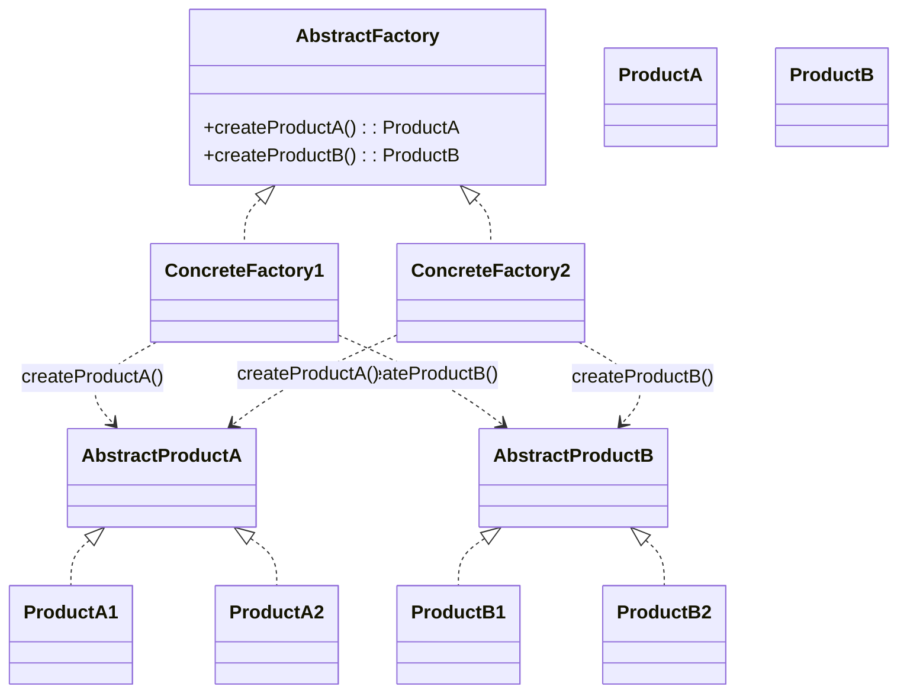
```mermaid
classDiagram
    direction TD
    class AbstractFactory {
      +createProductA(): ProductA
      +createProductB(): ProductB
    }
    class ConcreteFactory1
    class ConcreteFactory2
    class ProductA
    class ProductA1
    class ProductA2
    class ProductB
    class ProductB1
    class ProductB2

    AbstractFactory <|.. ConcreteFactory1
    AbstractFactory <|.. ConcreteFactory2

    class AbstractProductA
    class AbstractProductB

    AbstractProductA <|.. ProductA1
    AbstractProductA <|.. ProductA2
    AbstractProductB <|.. ProductB1
    AbstractProductB <|.. ProductB2

    ConcreteFactory1 ..> AbstractProductA : createProductA()
    ConcreteFactory1 ..> AbstractProductB : createProductB()
    ConcreteFactory2 ..> AbstractProductA : createProductA()
    ConcreteFactory2 ..> AbstractProductB : createProductB()
```

## 2. Builder

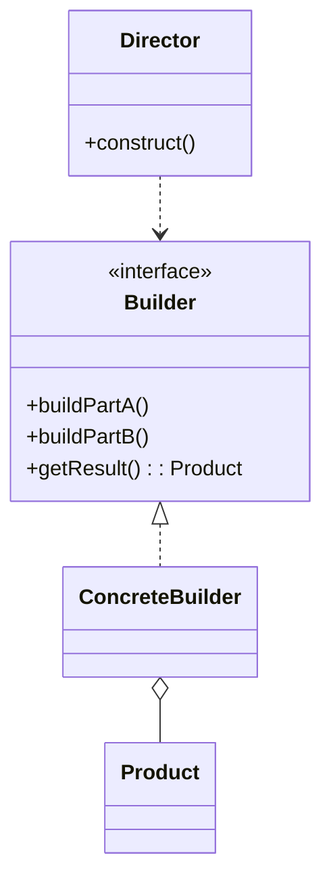
```mermaid
classDiagram
    direction TD
    class Director {
      +construct()
    }
    class Builder {
      <<interface>>
      +buildPartA()
      +buildPartB()
      +getResult(): Product
    }
    class ConcreteBuilder
    class Product

    Director ..> Builder
    Builder <|.. ConcreteBuilder
    ConcreteBuilder o-- Product
```

## 3. Factory Method

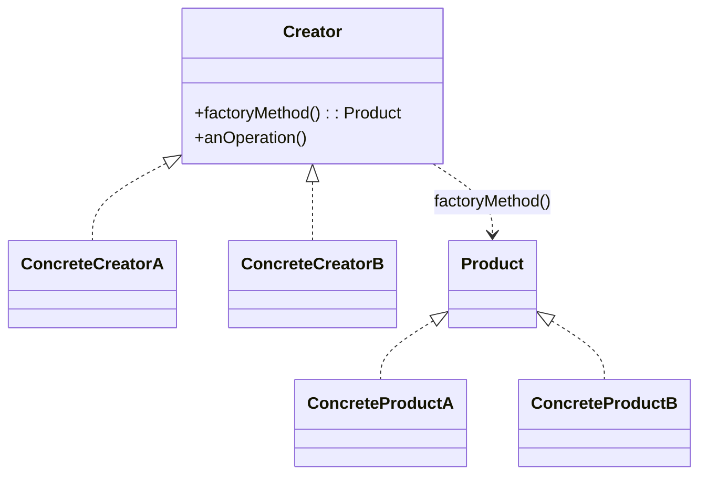
```mermaid
classDiagram
    direction TD
    class Creator {
      +factoryMethod(): Product
      +anOperation()
    }
    class ConcreteCreatorA
    class ConcreteCreatorB
    class Product
    class ConcreteProductA
    class ConcreteProductB

    Creator <|.. ConcreteCreatorA
    Creator <|.. ConcreteCreatorB
    Product <|.. ConcreteProductA
    Product <|.. ConcreteProductB
    Creator ..> Product : factoryMethod()
```

## 4. Prototype

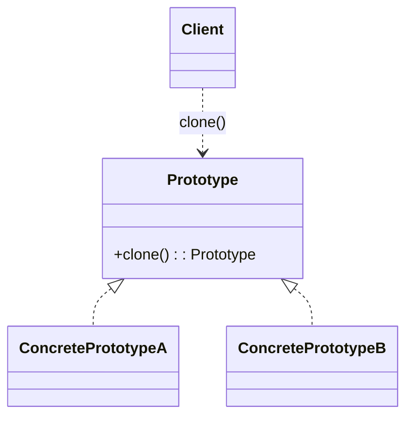
```mermaid
classDiagram
    direction TD
    class Prototype {
      +clone(): Prototype
    }
    class ConcretePrototypeA
    class ConcretePrototypeB
    class Client

    Prototype <|.. ConcretePrototypeA
    Prototype <|.. ConcretePrototypeB
    Client ..> Prototype : clone()
```

## 5. Singleton

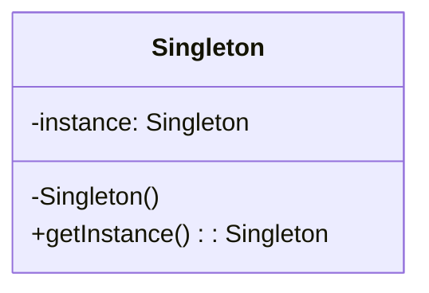
```mermaid
classDiagram
    direction TD
    class Singleton {
      -instance: Singleton
      -Singleton()
      +getInstance(): Singleton
    }
```
---
# Patrones Estructurales
---
## 6. Adapter (Clase)

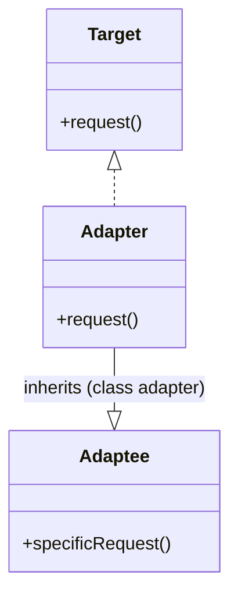
```mermaid
classDiagram
    direction TD
    class Target {
      +request()
    }
    class Adapter {
      +request()
    }
    class Adaptee {
      +specificRequest()
    }
    Target <|.. Adapter
    Adapter --|> Adaptee : inherits (class adapter)
```

## 7. Adapter (Objeto)

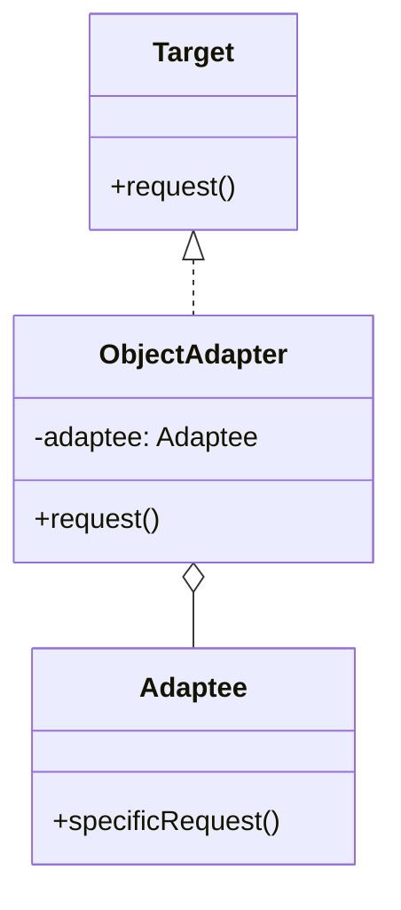
```mermaid
classDiagram
    direction TD
    class Target {
      +request()
    }
    class ObjectAdapter {
      +request()
      -adaptee: Adaptee
    }
    class Adaptee {
      +specificRequest()
    }
    ObjectAdapter o-- Adaptee
    Target <|.. ObjectAdapter
```

## 8. Bridge

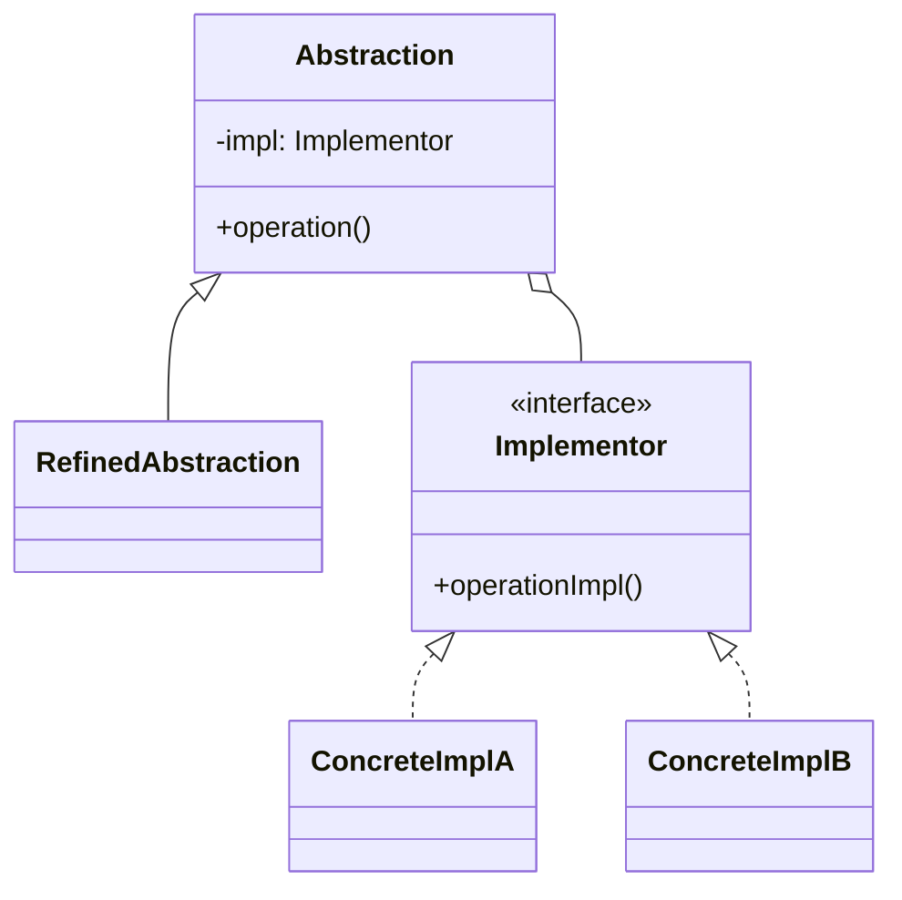
```mermaid
classDiagram
    direction TD
    class Abstraction {
      -impl: Implementor
      +operation()
    }
    class RefinedAbstraction
    class Implementor {
      <<interface>>
      +operationImpl()
    }
    class ConcreteImplA
    class ConcreteImplB

    Abstraction <|-- RefinedAbstraction
    Implementor <|.. ConcreteImplA
    Implementor <|.. ConcreteImplB
    Abstraction o-- Implementor
```

## 9. Composite

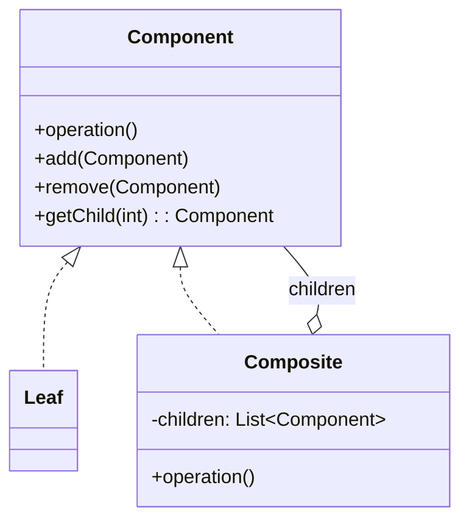
```mermaid
classDiagram
    direction TD
    class Component {
      +operation()
      +add(Component)
      +remove(Component)
      +getChild(int): Component
    }
    class Leaf
    class Composite {
      -children: List~Component~
      +operation()
    }

    Component <|.. Leaf
    Component <|.. Composite
    Composite o-- Component : children
```

## 10. Decorator

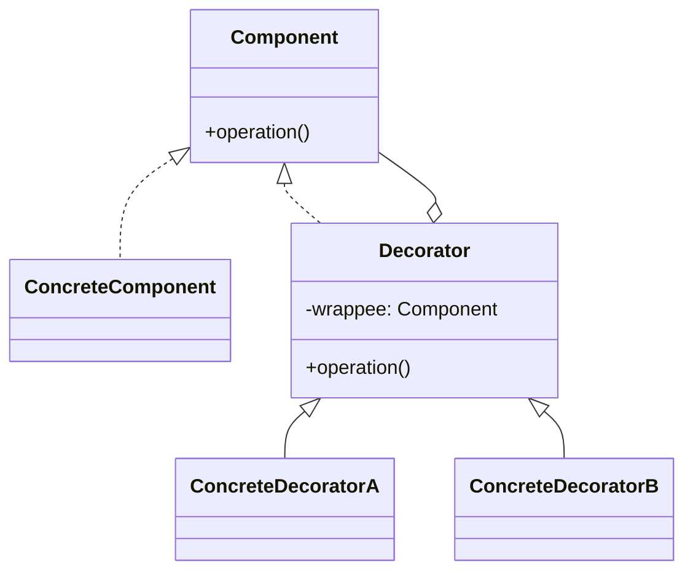
```mermaid
classDiagram
    direction TD
    class Component {
      +operation()
    }
    class ConcreteComponent
    class Decorator {
      -wrappee: Component
      +operation()
    }
    class ConcreteDecoratorA
    class ConcreteDecoratorB

    Component <|.. ConcreteComponent
    Component <|.. Decorator
    Decorator o-- Component
    Decorator <|-- ConcreteDecoratorA
    Decorator <|-- ConcreteDecoratorB
```

## 11. Facade

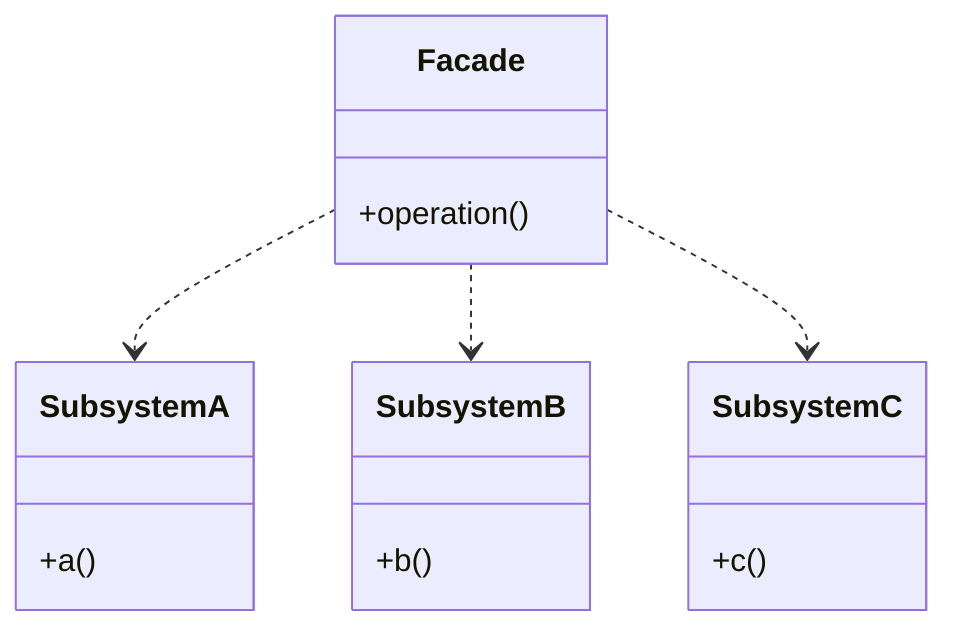
```mermaid
classDiagram
    direction TD
    class Facade {
      +operation()
    }
    class SubsystemA {+a()}
    class SubsystemB {+b()}
    class SubsystemC {+c()}

    Facade ..> SubsystemA
    Facade ..> SubsystemB
    Facade ..> SubsystemC
```

## 12. Flyweight

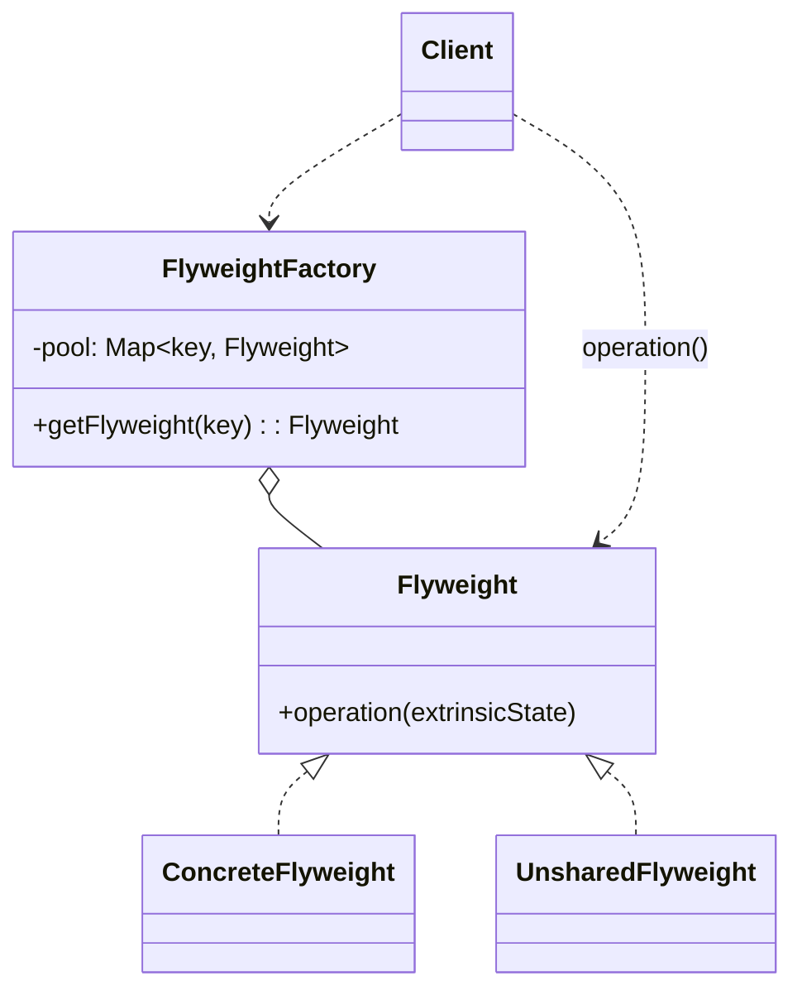
```mermaid
classDiagram
    direction TD
    class Flyweight {
      +operation(extrinsicState)
    }
    class ConcreteFlyweight
    class UnsharedFlyweight
    class FlyweightFactory {
      -pool: Map~key, Flyweight~
      +getFlyweight(key): Flyweight
    }
    class Client

    Flyweight <|.. ConcreteFlyweight
    Flyweight <|.. UnsharedFlyweight
    FlyweightFactory o-- Flyweight
    Client ..> FlyweightFactory
    Client ..> Flyweight : operation()
```
---
# Patrones de Comportamiento
---

## 13. Proxy

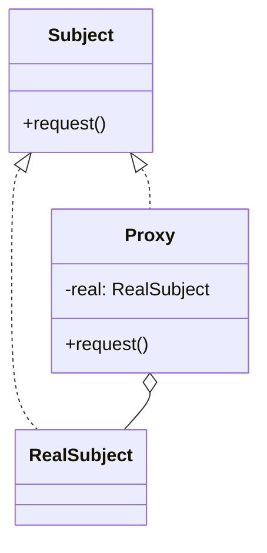
```mermaid
classDiagram
    direction TD
    class Subject {
      +request()
    }
    class RealSubject
    class Proxy {
      -real: RealSubject
      +request()
    }

    Subject <|.. RealSubject
    Subject <|.. Proxy
    Proxy o-- RealSubject
```

## 14. Chain of Responsibility

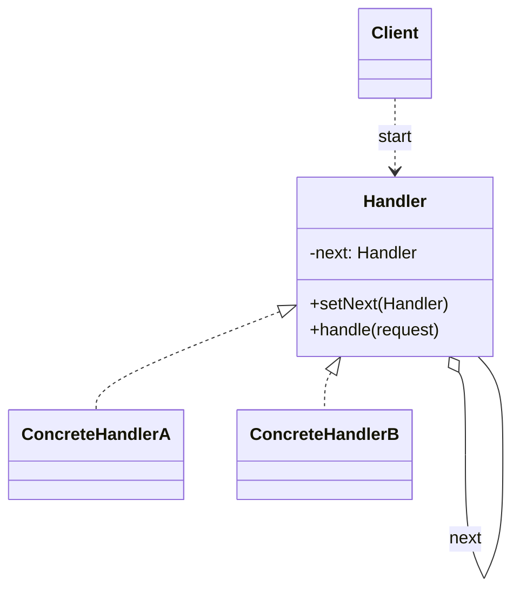
```mermaid
classDiagram
    direction TD
    class Handler {
      -next: Handler
      +setNext(Handler)
      +handle(request)
    }
    class ConcreteHandlerA
    class ConcreteHandlerB
    class Client

    Handler <|.. ConcreteHandlerA
    Handler <|.. ConcreteHandlerB
    Handler o-- Handler : next
    Client ..> Handler : start
```

## 15. Command

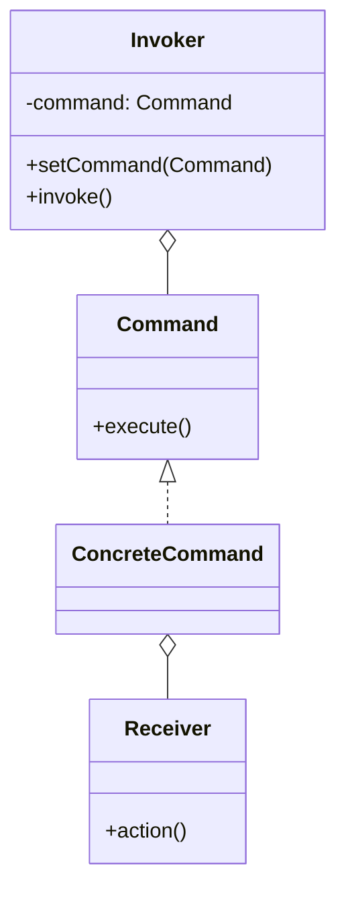
```mermaid
classDiagram
    direction TD
    class Command {
      +execute()
    }
    class ConcreteCommand
    class Invoker {
      -command: Command
      +setCommand(Command)
      +invoke()
    }
    class Receiver {
      +action()
    }

    Command <|.. ConcreteCommand
    Invoker o-- Command
    ConcreteCommand o-- Receiver
```

## 16. Interpreter

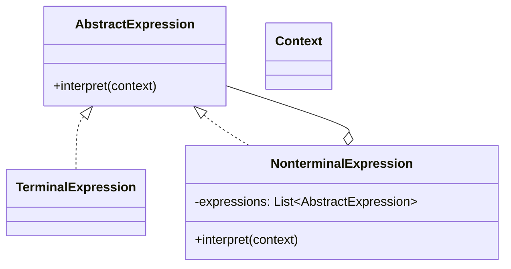
```mermaid
classDiagram
    direction TD
    class AbstractExpression {
      +interpret(context)
    }
    class TerminalExpression
    class NonterminalExpression {
      -expressions: List~AbstractExpression~
      +interpret(context)
    }
    class Context

    AbstractExpression <|.. TerminalExpression
    AbstractExpression <|.. NonterminalExpression
    NonterminalExpression o-- AbstractExpression
```

## 17. Iterator

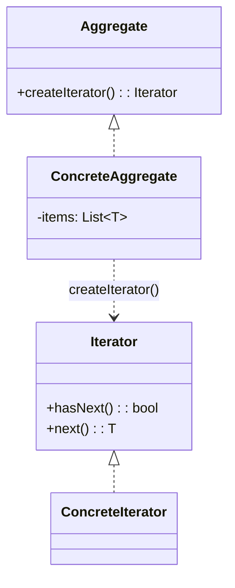
```mermaid
classDiagram
    direction TD
    class Iterator {
      +hasNext(): bool
      +next(): T
    }
    class ConcreteIterator
    class Aggregate {
      +createIterator(): Iterator
    }
    class ConcreteAggregate {
      -items: List~T~
    }

    Iterator <|.. ConcreteIterator
    Aggregate <|.. ConcreteAggregate
    ConcreteAggregate ..> Iterator : createIterator()
```

## 18. Mediator

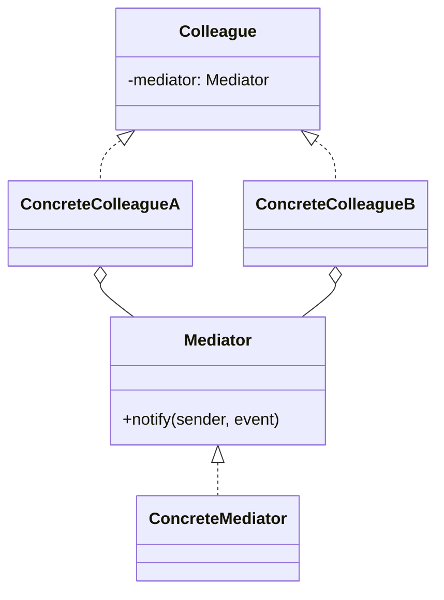
```mermaid
classDiagram
    direction TD
    class Mediator {
      +notify(sender, event)
    }
    class ConcreteMediator
    class Colleague {
      -mediator: Mediator
    }
    class ConcreteColleagueA
    class ConcreteColleagueB

    Mediator <|.. ConcreteMediator
    Colleague <|.. ConcreteColleagueA
    Colleague <|.. ConcreteColleagueB
    ConcreteColleagueA o-- Mediator
    ConcreteColleagueB o-- Mediator
```

## 19. Memento

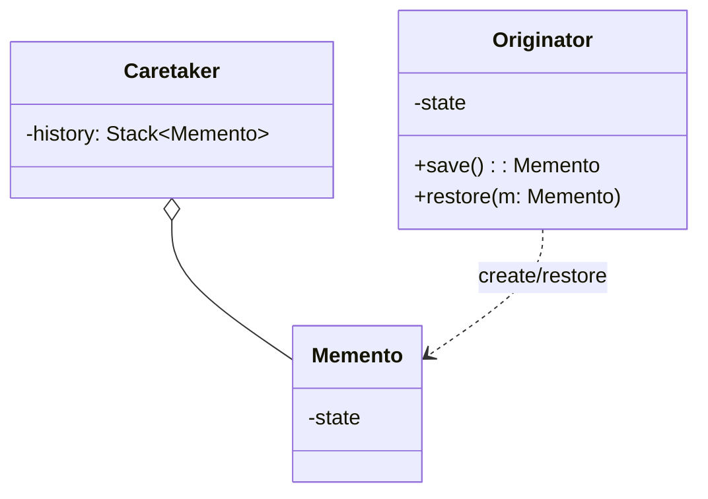
```mermaid
classDiagram
    direction TD
    class Originator {
      -state
      +save(): Memento
      +restore(m: Memento)
    }
    class Memento {
      -state
    }
    class Caretaker {
      -history: Stack~Memento~
    }

    Caretaker o-- Memento
    Originator ..> Memento : create/restore
```

## 20. Observer

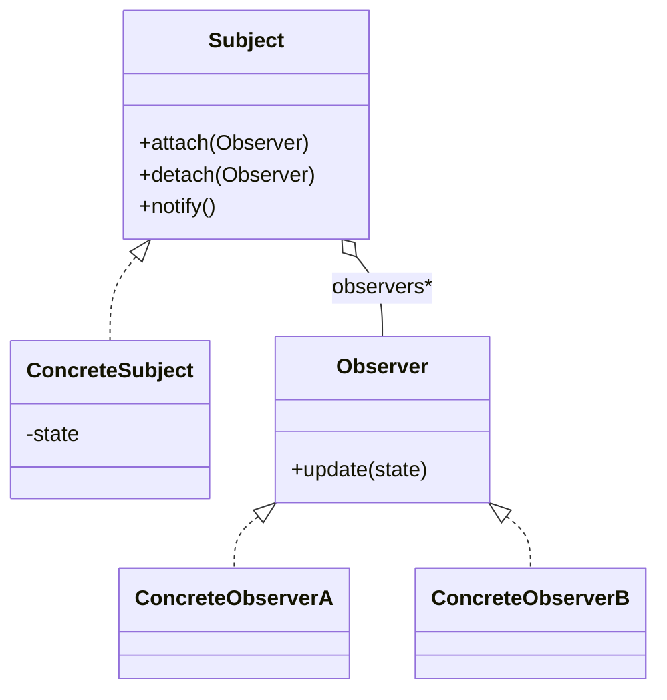
```mermaid
classDiagram
    direction TD
    class Subject {
      +attach(Observer)
      +detach(Observer)
      +notify()
    }
    class ConcreteSubject {
      -state
    }
    class Observer {
      +update(state)
    }
    class ConcreteObserverA
    class ConcreteObserverB

    Subject <|.. ConcreteSubject
    Observer <|.. ConcreteObserverA
    Observer <|.. ConcreteObserverB
    Subject o-- Observer : observers*
```

## 21. State

```mermaid
classDiagram
    direction TD
    class Context {
      -state: State
      +request()
      +setState(State)
    }
    class State {
      +handle(Context)
    }
    class ConcreteStateA
    class ConcreteStateB

    State <|.. ConcreteStateA
    State <|.. ConcreteStateB
    Context o-- State
```

## 22. Strategy

```mermaid
classDiagram
    direction TD
    class Context {
      -strategy: Strategy
      +doWork()
      +setStrategy(Strategy)
    }
    class Strategy {
      +execute()
    }
    class ConcreteStrategyA
    class ConcreteStrategyB

    Strategy <|.. ConcreteStrategyA
    Strategy <|.. ConcreteStrategyB
    Context o-- Strategy
```

## 23. Template Method

```mermaid
classDiagram
    direction TD
    class AbstractClass {
      +templateMethod()
      #primitiveOp1()
      #primitiveOp2()
      #hook()
    }
    class ConcreteClassA
    class ConcreteClassB

    AbstractClass <|.. ConcreteClassA
    AbstractClass <|.. ConcreteClassB
```

## 24. Visitor

```mermaid
classDiagram
    direction TD
    class Visitor {
      +visitConcreteElementA(A)
      +visitConcreteElementB(B)
    }
    class ConcreteVisitor1
    class ConcreteVisitor2
    class Element {
      +accept(Visitor)
    }
    class ConcreteElementA
    class ConcreteElementB
    class ObjectStructure {
      -elements: List~Element~
    }

    Visitor <|.. ConcreteVisitor1
    Visitor <|.. ConcreteVisitor2
    Element <|.. ConcreteElementA
    Element <|.. ConcreteElementB
    Element ..> Visitor : accept(v)
    ObjectStructure o-- Element
```

---

### Sugerencias de uso

* Si necesitas **variantes** (e.g., Singleton thread-safe, Strategy genérica), indícame el lenguaje objetivo y agrego detalles.
* Puedo convertir cualquiera de estos diagramas a **PlantUML** o generar **SVG/PNG** si lo requieres.
