# GoF Design Patterns — Canonical (GoF) Structure for the 23 Patterns

This README rewrites each pattern using the **canonical GoF outline** (Intent → Motivation → Applicability → Structure → Participants → Collaborations → Consequences → Implementation → Related Patterns). Each entry includes a compact **Mermaid class diagram** under *Structure*.

> Scope: concise, field-ready summaries (1–3 bullets per section) so you can scan quickly or use as lecture notes.

---

## Creational Patterns

### 1) Abstract Factory
**Intent**  
Create families of related objects without specifying their concrete classes.

**Motivation**  
UI toolkits need widgets that match a theme (e.g., Light/Dark). Choose a factory by family, not by individual class.

**Applicability**  
- You need to enforce product families’ consistency.  
- You want to vary whole families at runtime.

**Structure**
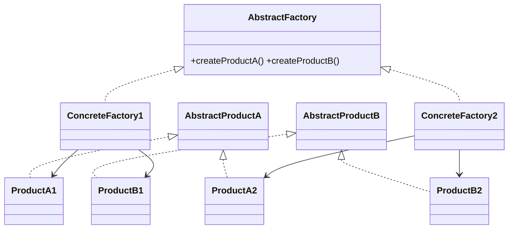
```mermaid
classDiagram
class AbstractFactory {+createProductA() +createProductB()}
class ConcreteFactory1
class ConcreteFactory2
class AbstractProductA
class AbstractProductB
class ProductA1
class ProductB1
class ProductA2
class ProductB2
AbstractFactory <|.. ConcreteFactory1
AbstractFactory <|.. ConcreteFactory2
AbstractProductA <|.. ProductA1
AbstractProductA <|.. ProductA2
AbstractProductB <|.. ProductB1
AbstractProductB <|.. ProductB2
ConcreteFactory1 --> ProductA1
ConcreteFactory1 --> ProductB1
ConcreteFactory2 --> ProductA2
ConcreteFactory2 --> ProductB2
```

**Participants**  
- *AbstractFactory*: interface to create abstract products.  
- *ConcreteFactory*: creates concrete products.  
- *AbstractProduct / Product*: families of products.

**Collaborations**  
Clients use only factories and abstract products; concrete classes are hidden.

**Consequences**  
+ Ensures family consistency; swaps families easily.  
− Hard to add new product types (requires touching all factories).

**Implementation**  
- Factories often implemented with Factory Method.  
- Consider object registries for family selection.

**Related Patterns**  
Factory Method, Prototype.

---

### 2) Builder
**Intent**  
Separate complex object construction from its representation.

**Motivation**  
Build the same "meal" step-by-step with different ingredient choices (builders).

**Applicability**  
- Complex assembly with optional steps/order.  
- Different representations via the same process.

**Structure**
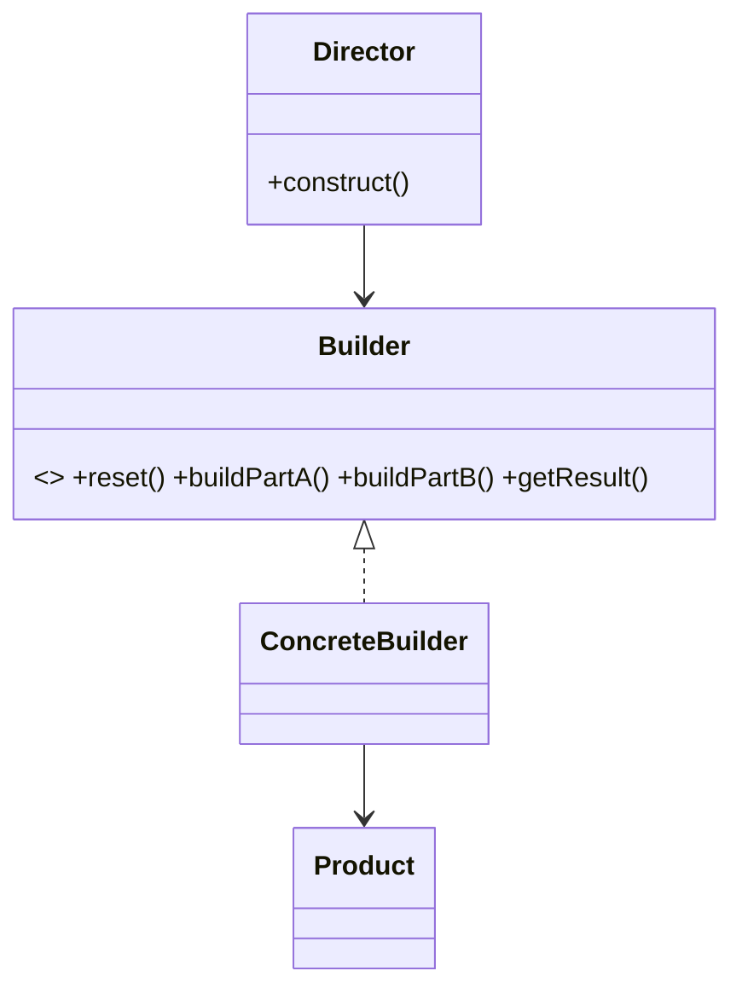
```mermaid
classDiagram
class Director{+construct()}
class Builder{<<interface>> +reset() +buildPartA() +buildPartB() +getResult()}
class ConcreteBuilder
class Product
Director --> Builder
Builder <|.. ConcreteBuilder
ConcreteBuilder --> Product
```

**Participants**  
- *Director*: controls construction steps.  
- *Builder*: defines building steps.  
- *ConcreteBuilder*: accumulates product.  
- *Product*: final result.

**Collaborations**  
Director calls builders’ steps in sequence; client retrieves product from builder.

**Consequences**  
+ Isolates construction logic; supports variants.  
− Requires extra classes; may be overkill for simple objects.

**Implementation**  
- Fluent APIs; immutable products (build then freeze).  
- Reuse builders for partial presets.

**Related Patterns**  
Abstract Factory (families), Composite (assembly trees).

---

### 3) Factory Method
**Intent**  
Define an interface for object creation, letting subclasses choose the concrete class.

**Motivation**  
A framework needs to create application-specific documents without knowing their concrete type.

**Applicability**  
- Framework/library wants to delegate instantiation.  
- A class can’t anticipate which class to create.

**Structure**
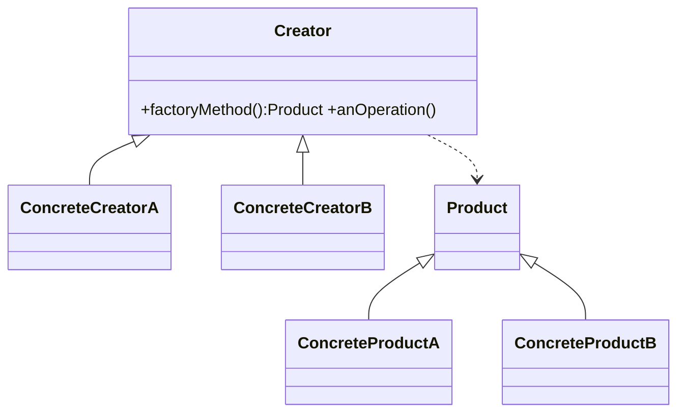
```mermaid
classDiagram
class Creator{+factoryMethod():Product +anOperation()}
class ConcreteCreatorA
class ConcreteCreatorB
class Product
class ConcreteProductA
class ConcreteProductB
Creator <|-- ConcreteCreatorA
Creator <|-- ConcreteCreatorB
Product <|-- ConcreteProductA
Product <|-- ConcreteProductB
Creator ..> Product
```

**Participants**  
- *Creator*: declares factoryMethod; may use its product.  
- *ConcreteCreator*: overrides to return specific product.  
- *Product/ConcreteProduct*.

**Collaborations**  
anOperation() often calls factoryMethod() then uses the product.

**Consequences**  
+ Hooks for extension; decouples Creator from concrete products.  
− Adds subclassing; may lead to class explosion.

**Implementation**  
- Parameterized factory methods; switch to registry-based creators.  
- Combine with dependency injection.

**Related Patterns**  
Abstract Factory, Template Method.

---

### 4) Prototype
**Intent**  
Create new objects by copying a prototypical instance.

**Motivation**  
When class instantiation is expensive or unknown until runtime, clone a prepared exemplar.

**Applicability**  
- Many variants configured at runtime.  
- Avoid subclassing factories/creators.

**Structure**
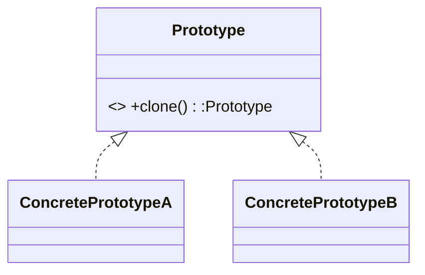
```mermaid
classDiagram
class Prototype{<<interface>> +clone():Prototype}
class ConcretePrototypeA
class ConcretePrototypeB
Prototype <|.. ConcretePrototypeA
Prototype <|.. ConcretePrototypeB
```

**Participants**  
- *Prototype*: declares clone.  
- *ConcretePrototype*: implements deep/shallow copy.

**Collaborations**  
Client keeps a registry of prototypes and clones on demand.

**Consequences**  
+ Adds/remove products at runtime; reduces subclassing.  
− Cloning complexity (deep vs. shallow, cycles).

**Implementation**  
- Copy constructors, serialization deep-copies.  
- Manage IDs to avoid collisions after clone.

**Related Patterns**  
Abstract Factory (build families from prototypes), Composite (clone subtrees).

---

### 5) Singleton
**Intent**  
Ensure a class has one instance and provide a global access point.

**Motivation**  
One configuration/service gateway per process.

**Applicability**  
- Exactly one (or controlled few) instances.  
- Centralized access required.

**Structure**
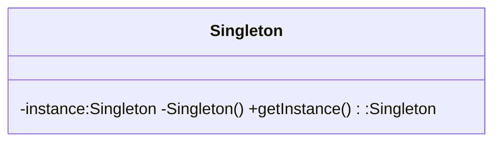
```mermaid
classDiagram
class Singleton{-instance:Singleton -Singleton() +getInstance():Singleton}
```

**Participants**  
- *Singleton*: manages its sole instance.

**Collaborations**  
Clients call `getInstance()` to obtain the instance.

**Consequences**  
+ Controlled access; lazy initialization.  
− Hidden dependencies; hard to test/parallelize.

**Implementation**  
- Thread-safe lazy init (double-checked locking, language primitives).  
- Prefer DI containers over hard Singletons.

**Related Patterns**  
Facade (global entry), Flyweight (shared instances).

---

## Structural Patterns

### 6) Adapter
**Intent**  
Convert one interface to another clients expect.

**Motivation**  
Reuse an existing class whose interface doesn’t match the target API.

**Applicability**  
- Integrating legacy/third‑party components.  
- Bridging incompatible interfaces.

**Structure**
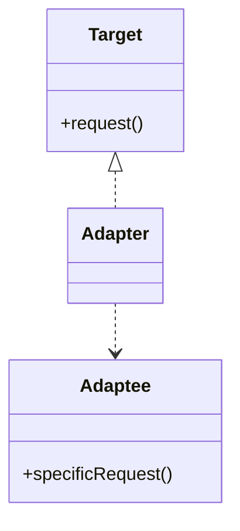
```mermaid
classDiagram
class Target{+request()}
class Adapter
class Adaptee{+specificRequest()}
Target <|.. Adapter
Adapter ..> Adaptee
```

**Participants**  
- *Target*: desired interface.  
- *Adapter*: implements Target via Adaptee.  
- *Adaptee*: existing service.

**Collaborations**  
Adapter translates Target calls into Adaptee calls.

**Consequences**  
+ Enables reuse; isolates incompatibilities.  
− Adds indirection; may hide performance pitfalls.

**Implementation**  
- Class vs. object adapter (inherit vs. wrap).  
- Map parameter/return types carefully.

**Related Patterns**  
Bridge (orthogonal abstraction/impl), Decorator (adds behavior, same interface).

---

### 7) Bridge
**Intent**  
Decouple abstraction from implementation so both vary independently.

**Motivation**  
Matrix operations across different hardware backends (CPU/GPU) without exploding subclasses.

**Applicability**  
- Cross-product class hierarchies.  
- Swap implementations at runtime.

**Structure**
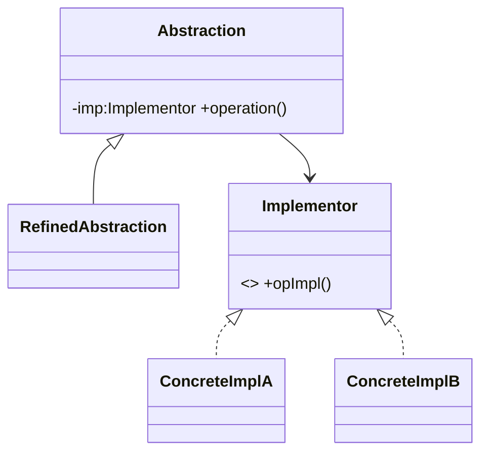
```mermaid
classDiagram
class Abstraction{-imp:Implementor +operation()}
class RefinedAbstraction
class Implementor{<<interface>> +opImpl()}
class ConcreteImplA
class ConcreteImplB
Abstraction <|-- RefinedAbstraction
Implementor <|.. ConcreteImplA
Implementor <|.. ConcreteImplB
Abstraction --> Implementor
```

**Participants**  
- *Abstraction/RefinedAbstraction*.  
- *Implementor/ConcreteImplementor*.

**Collaborations**  
Abstraction forwards high-level calls to Implementor.

**Consequences**  
+ Controls class explosion; swap impls easily.  
− More indirection; harder to debug across layers.

**Implementation**  
- Dependency injection of Implementor.  
- Keep Implementor interface minimal.

**Related Patterns**  
Adapter, Strategy.

---

### 8) Composite
**Intent**  
Compose objects into tree structures to represent part–whole hierarchies.

**Motivation**  
Treat individual widgets and containers uniformly in GUIs.

**Applicability**  
- Tree structures; uniform operations.  
- Recursive algorithms over parts and wholes.

**Structure**
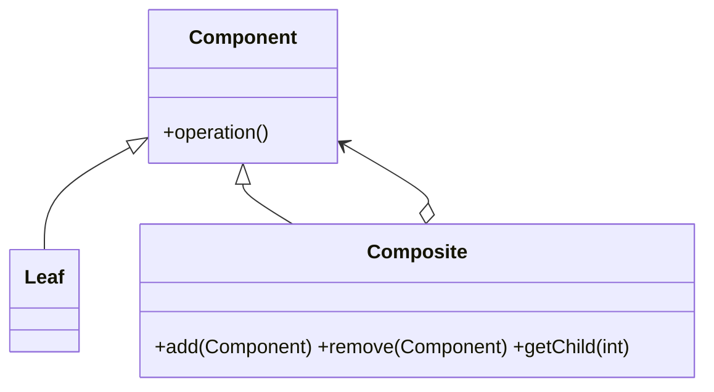
```mermaid
classDiagram
class Component{+operation()}
class Leaf
class Composite{+add(Component) +remove(Component) +getChild(int)}
Component <|-- Leaf
Component <|-- Composite
Composite o--> Component
```

**Participants**  
- *Component*: common interface.  
- *Leaf*: primitive element.  
- *Composite*: holds children.

**Collaborations**  
Clients treat Leaf and Composite uniformly via Component.

**Consequences**  
+ Simplifies client code; supports arbitrarily deep trees.  
− Hard to restrict allowed children; can obscure invariants.

**Implementation**  
- Manage parent links; iterators over trees.  
- Safety vs. transparency trade‑off for child operations.

**Related Patterns**  
Iterator, Visitor, Interpreter.

---

### 9) Decorator
**Intent**  
Attach responsibilities to objects dynamically.

**Motivation**  
Add scrolling/borders/logging to a widget without making huge subclasses.

**Applicability**  
- Add/remove features at runtime.  
- Avoid subclass explosion for combinations.

**Structure**
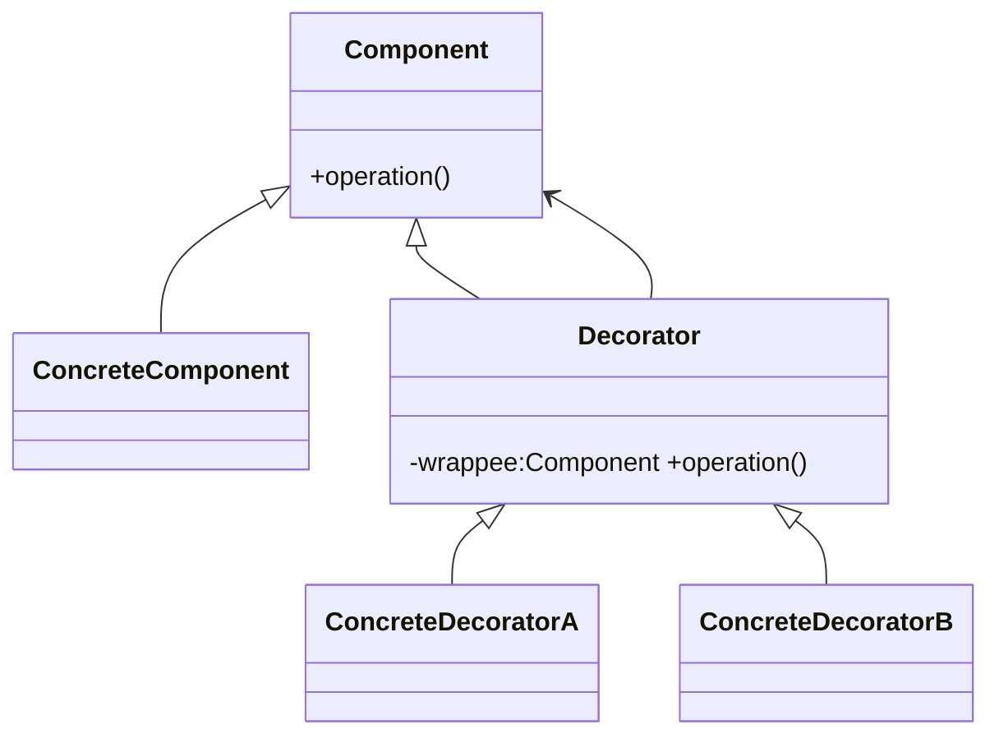
```mermaid
classDiagram
class Component{+operation()}
class ConcreteComponent
class Decorator{-wrappee:Component +operation()}
class ConcreteDecoratorA
class ConcreteDecoratorB
Component <|-- ConcreteComponent
Component <|-- Decorator
Decorator <|-- ConcreteDecoratorA
Decorator <|-- ConcreteDecoratorB
Decorator --> Component
```

**Participants**  
- *Component/ConcreteComponent*.  
- *Decorator/ConcreteDecorator*.

**Collaborations**  
Decorator forwards to wrappee, then adds behavior.

**Consequences**  
+ Flexible layering; adheres to Open/Closed.  
− Many small objects; ordering of decorators matters.

**Implementation**  
- Keep interface parity; consider transparency for clients.  
- Compose-safe: avoid double side effects.

**Related Patterns**  
Adapter (interface change), Proxy (control access), Composite (nested structure).

---

### 10) Facade
**Intent**  
Provide a unified interface to a subsystem.

**Motivation**  
Simplify complex library startup and usage with a single entrypoint.

**Applicability**  
- Layered subsystems.  
- Reduce coupling between clients and internals.

**Structure**
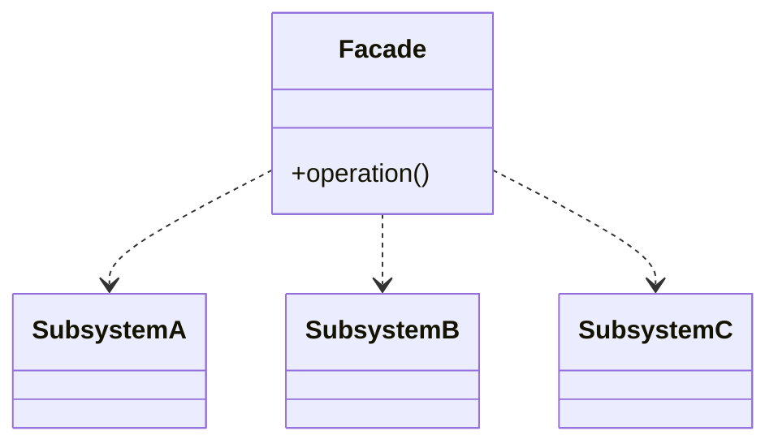
```mermaid
classDiagram
class Facade{+operation()}
class SubsystemA
class SubsystemB
class SubsystemC
Facade ..> SubsystemA
Facade ..> SubsystemB
Facade ..> SubsystemC
```

**Participants**  
- *Facade*: simple interface.  
- *Subsystem classes*: actual work.

**Collaborations**  
Clients depend only on Facade; subsystems remain independent.

**Consequences**  
+ Shields complexity; promotes weak coupling.  
− Risk of God-object anti‑pattern if overloaded.

**Implementation**  
- Keep Facade thin; avoid stateful logic.  
- Provide multiple facades per concern if needed.

**Related Patterns**  
Mediator (object interaction), Singleton (global facade instance).

---

### 11) Flyweight
**Intent**  
Share objects efficiently to support large numbers of fine‑grained instances.

**Motivation**  
Render millions of glyphs by sharing intrinsic character data and varying extrinsic position/size.

**Applicability**  
- Huge object counts; memory hotspots.  
- Identifiable intrinsic vs. extrinsic state.

**Structure**
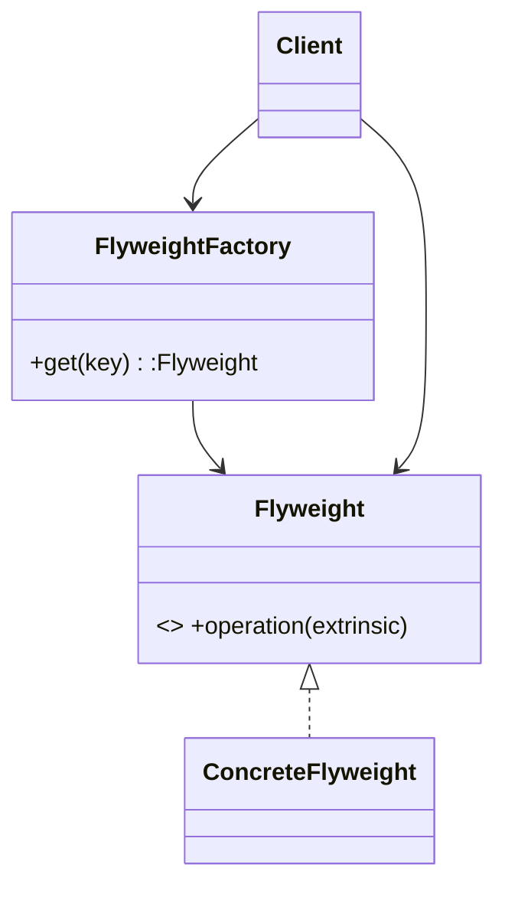
```mermaid
classDiagram
class Flyweight{<<interface>> +operation(extrinsic)}
class ConcreteFlyweight
class FlyweightFactory{+get(key):Flyweight}
class Client
Flyweight <|.. ConcreteFlyweight
FlyweightFactory --> Flyweight
Client --> FlyweightFactory
Client --> Flyweight
```

**Participants**  
- *Flyweight*: shared part.  
- *Factory*: manages cache.  
- *Client*: supplies extrinsic state.

**Collaborations**  
Clients fetch shared flyweights and pass extrinsic data at use time.

**Consequences**  
+ Significant memory savings.  
− Complexity in separating state; more parameters per call.

**Implementation**  
- Interning maps; weak references for eviction.  
- Thread-safe caches.

**Related Patterns**  
Singleton (one), Prototype (clone then share), Proxy.

---

### 12) Proxy
**Intent**  
Provide a surrogate to control access to another object.

**Motivation**  
Lazy-load images; protect remote resources; add access control.

**Applicability**  
- Remote, virtual, protection, or smart references.  
- Add caching, logging, or security around a subject.

**Structure**
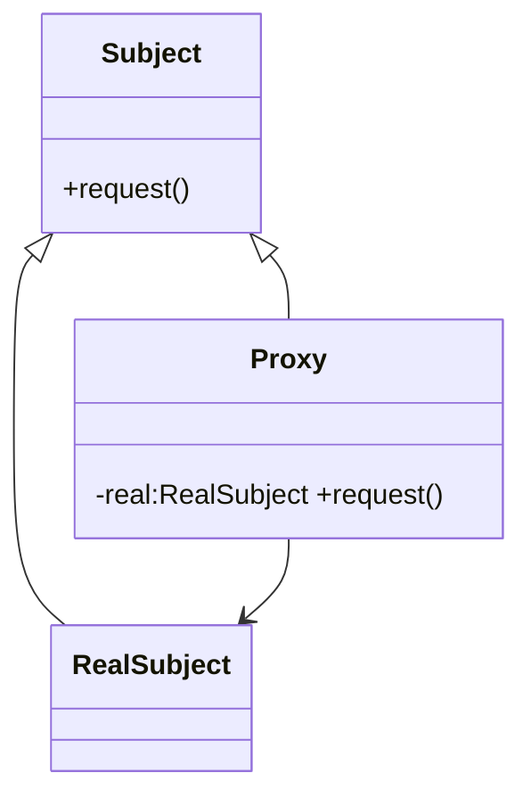
```mermaid
classDiagram
class Subject{+request()}
class RealSubject
class Proxy{-real:RealSubject +request()}
Subject <|-- RealSubject
Subject <|-- Proxy
Proxy --> RealSubject
```

**Participants**  
- *Subject/RealSubject*.  
- *Proxy*: controls/augments access.

**Collaborations**  
Proxy forwards to RealSubject and may add cross‑cutting behavior.

**Consequences**  
+ Laziness, security, remoting, caching.  
− Extra hop; consistency pitfalls between proxy and subject.

**Implementation**  
- Transparent interfaces; thread‑safe lazy init.  
- Consider codegen/dynamic proxies.

**Related Patterns**  
Decorator (adds behavior), Adapter (interface change), Facade (simplify access).

---

## Behavioral Patterns

### 13) Chain of Responsibility
**Intent**  
Decouple sender and receiver by giving multiple objects a chance to handle a request.

**Motivation**  
Validation/approval workflows where the next handler takes over if the prior can’t.

**Applicability**  
- Multiple potential handlers; dynamic chain composition.  
- Need to avoid hard-coded conditionals.

**Structure**
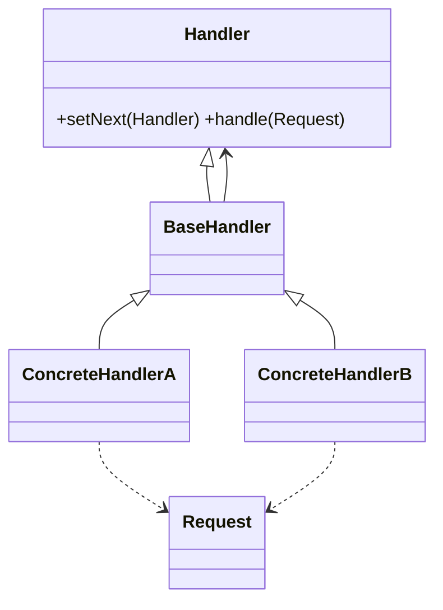
```mermaid
classDiagram
class Handler{+setNext(Handler) +handle(Request)}
class BaseHandler
class ConcreteHandlerA
class ConcreteHandlerB
class Request
Handler <|-- BaseHandler
BaseHandler <|-- ConcreteHandlerA
BaseHandler <|-- ConcreteHandlerB
BaseHandler --> Handler
ConcreteHandlerA ..> Request
ConcreteHandlerB ..> Request
```

**Participants**  
- *Handler/BaseHandler*: links chain.  
- *ConcreteHandlers*: decide to handle or pass on.

**Collaborations**  
Each handler either processes or forwards to `next`.

**Consequences**  
+ Flexible routing; reduces coupling.  
− Uncertain handling; debugging chain order.

**Implementation**  
- Immutable vs. mutable chains.  
- Termination rules (must-handle vs. best‑effort).

**Related Patterns**  
Command, Mediator.

---

### 14) Command
**Intent**  
Encapsulate requests as objects to support undo/redo, queuing, logging.

**Motivation**  
Menu items and buttons execute commands decoupled from receivers.

**Applicability**  
- Parameterize actions; queue or log.  
- Support undo/redo via mementos.

**Structure**
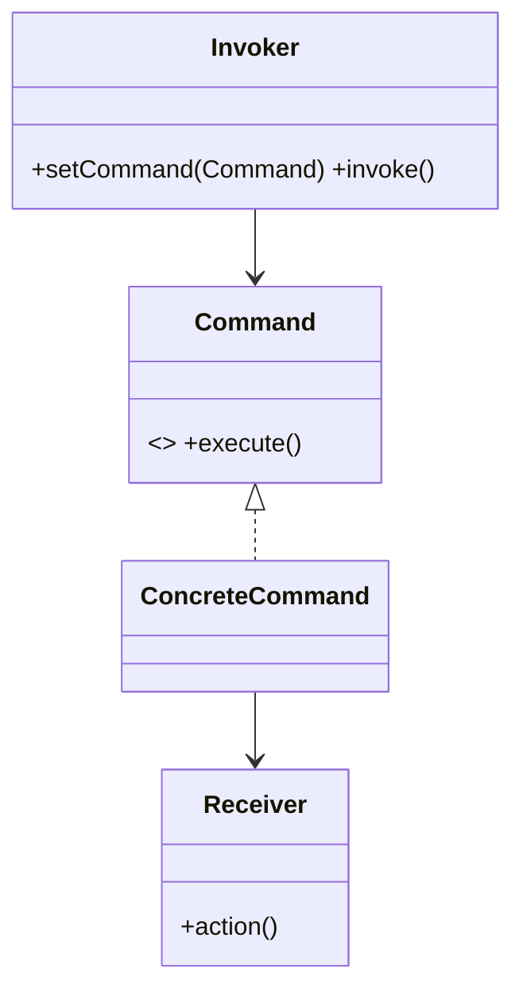
```mermaid
classDiagram
class Command{<<interface>> +execute()}
class ConcreteCommand
class Invoker{+setCommand(Command) +invoke()}
class Receiver{+action()}
Command <|.. ConcreteCommand
Invoker --> Command
ConcreteCommand --> Receiver
```

**Participants**  
- *Command/ConcreteCommand*.  
- *Invoker*: triggers.  
- *Receiver*: performs action.

**Collaborations**  
Invoker calls Command; Command calls Receiver.

**Consequences**  
+ Decoupling; macro commands; undo/redo.  
− Many small classes.

**Implementation**  
- Composite commands; history stacks.  
- Serialization for durable logs.

**Related Patterns**  
Memento, Composite, Chain of Responsibility.

---

### 15) Interpreter
**Intent**  
Define a grammar and interpret sentences using a class hierarchy of expressions.

**Motivation**  
Mini-languages (filters, rules) embedded in apps.

**Applicability**  
- Simple grammar with many recurring evaluations.  
- Performance is acceptable vs. parser generators.

**Structure**
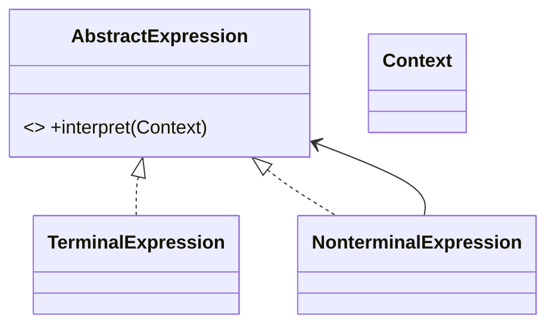
```mermaid
classDiagram
class AbstractExpression{<<interface>> +interpret(Context)}
class TerminalExpression
class NonterminalExpression
class Context
AbstractExpression <|.. TerminalExpression
AbstractExpression <|.. NonterminalExpression
NonterminalExpression --> AbstractExpression
```

**Participants**  
- *Terminal/NonterminalExpression*.  
- *Context*: global information/state.

**Collaborations**  
Nonterminals reference sub‑expressions; evaluation recurses.

**Consequences**  
+ Extensible grammar via classes.  
− Class explosion; poor performance on complex grammars.

**Implementation**  
- Combine with Visitor for operations.  
- Use parser tools if grammar grows.

**Related Patterns**  
Composite, Visitor, Flyweight.

---

### 16) Iterator
**Intent**  
Traverse aggregate elements without exposing representation.

**Motivation**  
Uniform iteration for lists, trees, maps.

**Applicability**  
- Need multiple concurrent traversals.  
- Want a uniform traversal API.

**Structure**
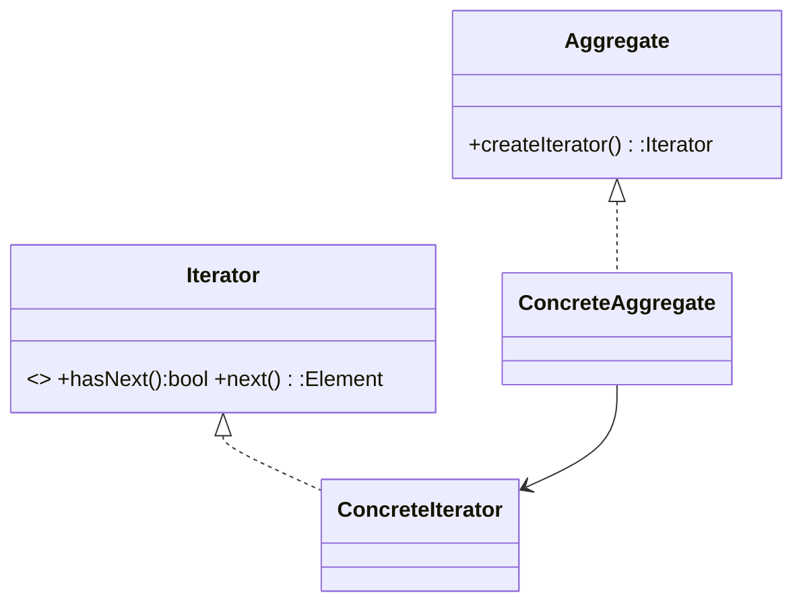
```mermaid
classDiagram
class Iterator{<<interface>> +hasNext():bool +next():Element}
class ConcreteIterator
class Aggregate{+createIterator():Iterator}
class ConcreteAggregate
Iterator <|.. ConcreteIterator
Aggregate <|.. ConcreteAggregate
ConcreteAggregate --> ConcreteIterator
```

**Participants**  
- *Iterator/ConcreteIterator*.  
- *Aggregate/ConcreteAggregate*.

**Collaborations**  
Aggregate creates Iterator; client controls traversal.

**Consequences**  
+ Multiple traversals; simplifies aggregates.  
− Extra objects; external vs. internal iteration trade‑offs.

**Implementation**  
- Fail‑fast vs. fail‑safe; lazy vs. eager.  
- Bidirectional or filtered iterators.

**Related Patterns**  
Composite (tree traversal), Memento (cursor state).

---

### 17) Mediator
**Intent**  
Encapsulate object interactions in a mediator to reduce coupling.

**Motivation**  
GUI widgets talk via a dialog mediator rather than directly.

**Applicability**  
- Complex webs of interactions.  
- Reuse individual colleagues independently.

**Structure**
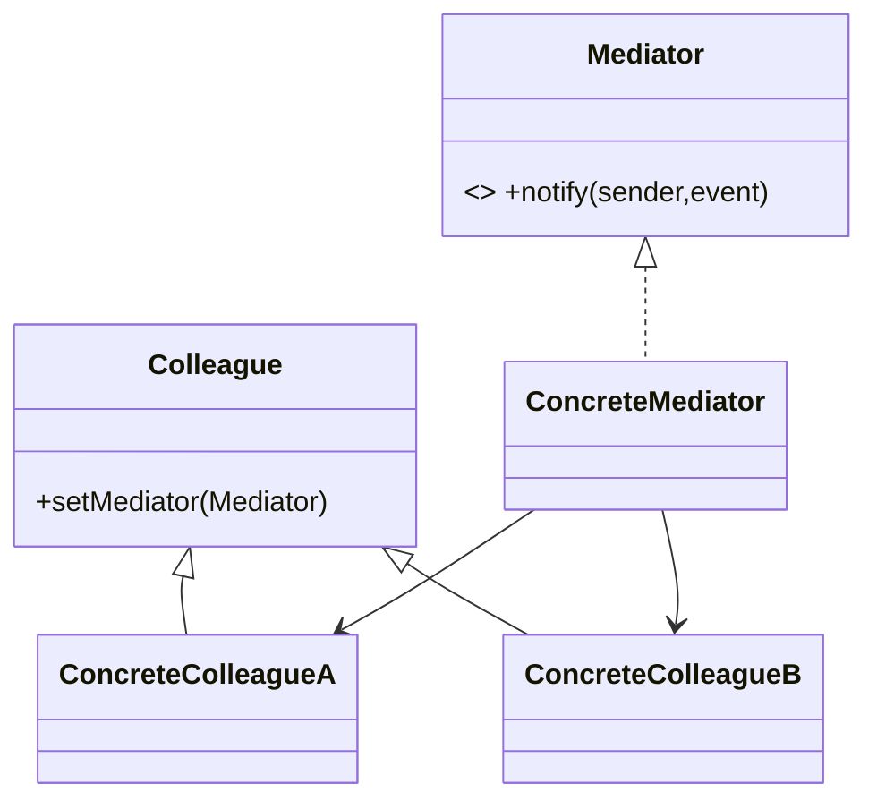
```mermaid
classDiagram
class Mediator{<<interface>> +notify(sender,event)}
class ConcreteMediator
class Colleague{+setMediator(Mediator)}
class ConcreteColleagueA
class ConcreteColleagueB
Mediator <|.. ConcreteMediator
Colleague <|-- ConcreteColleagueA
Colleague <|-- ConcreteColleagueB
ConcreteMediator --> ConcreteColleagueA
ConcreteMediator --> ConcreteColleagueB
```

**Participants**  
- *Mediator/ConcreteMediator*.  
- *Colleague/ConcreteColleague*.

**Collaborations**  
Colleagues notify Mediator; Mediator coordinates others.

**Consequences**  
+ Localizes behavior; reduces coupling.  
− Mediator can grow complex (god mediator).

**Implementation**  
- Event names/enums; pub‑sub under the hood.  
- Keep colleagues dumb; unit test mediator.

**Related Patterns**  
Observer (broadcast), Facade (simplify API).

---

### 18) Memento
**Intent**  
Capture and externalize an object’s state so it can be restored later.

**Motivation**  
Undo/redo editors without exposing internals.

**Applicability**  
- Need checkpointing/rollback.  
- Encapsulation must be preserved.

**Structure**
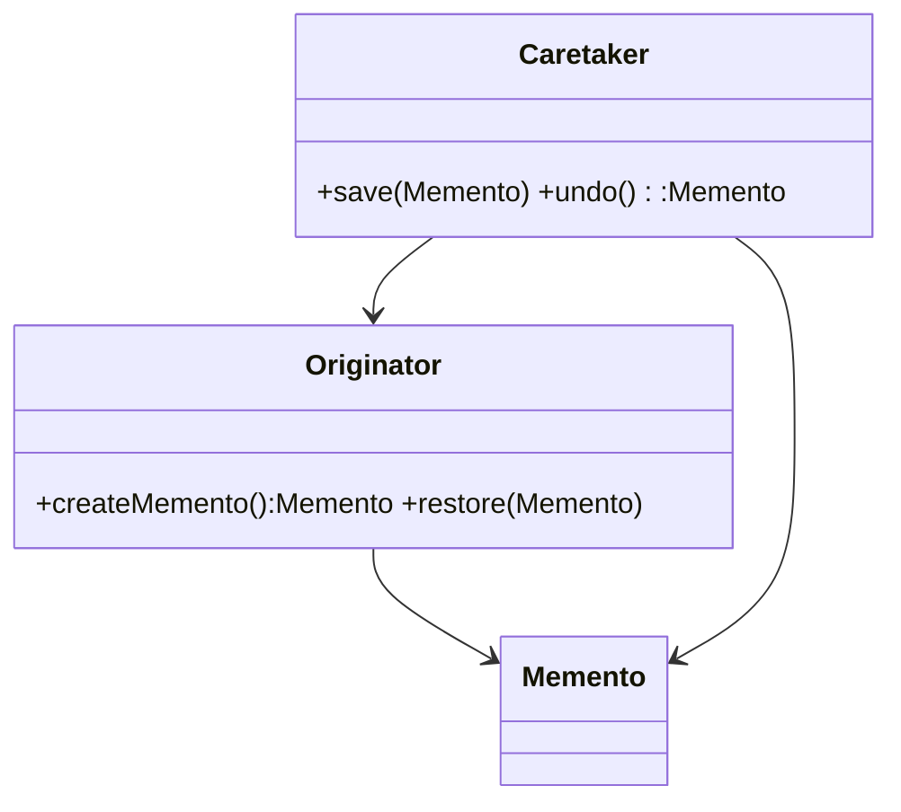
```mermaid
classDiagram
class Originator{+createMemento():Memento +restore(Memento)}
class Memento
class Caretaker{+save(Memento) +undo():Memento}
Originator --> Memento
Caretaker --> Memento
Caretaker --> Originator
```

**Participants**  
- *Originator*: makes/restores mementos.  
- *Memento*: state snapshot.  
- *Caretaker*: stores history.

**Collaborations**  
Caretaker holds opaque mementos and returns them for restore.

**Consequences**  
+ True undo without exposing state.  
− Memory/time cost; serialization concerns.

**Implementation**  
- Incremental (diff) mementos; compression.  
- Access control: narrow vs. wide interface.

**Related Patterns**  
Command (undo queues), Prototype (copy state).

---

### 19) Observer
**Intent**  
Define a one‑to‑many dependency so observers are notified automatically.

**Motivation**  
Data‑binding and event systems notify subscribers when subject changes.

**Applicability**  
- Multiple dependents.  
- Want loose coupling via publish/subscribe.

**Structure**
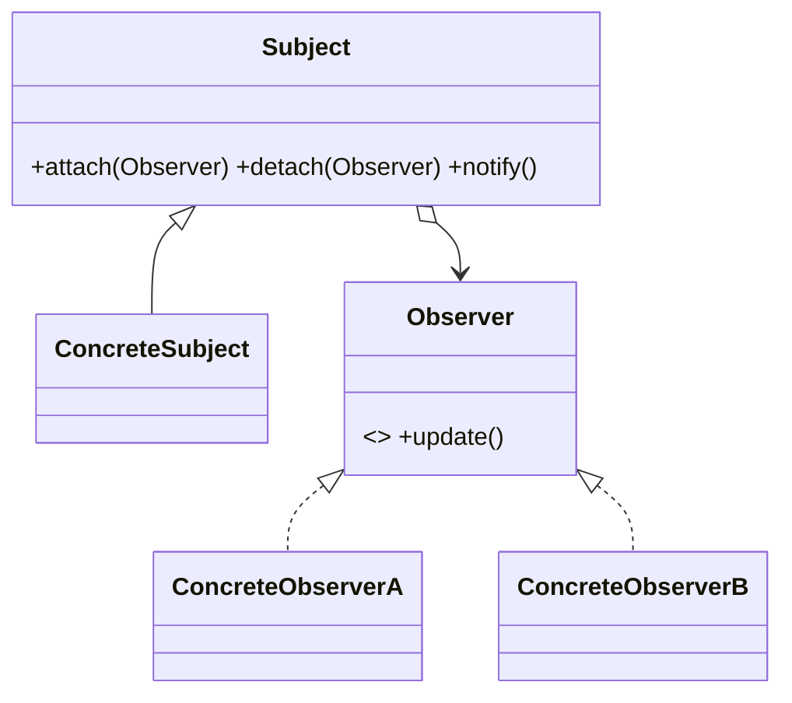
```mermaid
classDiagram
class Subject{+attach(Observer) +detach(Observer) +notify()}
class ConcreteSubject
class Observer{<<interface>> +update()}
class ConcreteObserverA
class ConcreteObserverB
Subject <|-- ConcreteSubject
Observer <|.. ConcreteObserverA
Observer <|.. ConcreteObserverB
Subject o--> Observer
```

**Participants**  
- *Subject/ConcreteSubject*.  
- *Observer/ConcreteObserver*.

**Collaborations**  
Subject pushes/pulls state to observers on change.

**Consequences**  
+ Decoupled updates; dynamic subscription.  
− Update storms; order and consistency issues.

**Implementation**  
- Push vs. pull models; async event queues.  
- Weak refs to prevent leaks.

**Related Patterns**  
Mediator, Singleton (event bus instance).

---

### 20) State
**Intent**  
Let an object alter behavior when its internal state changes.

**Motivation**  
TCP connection responds differently in Closed/Listen/Established.

**Applicability**  
- Behavior depends on state; many conditionals.  
- Want state objects to encapsulate transitions.

**Structure**
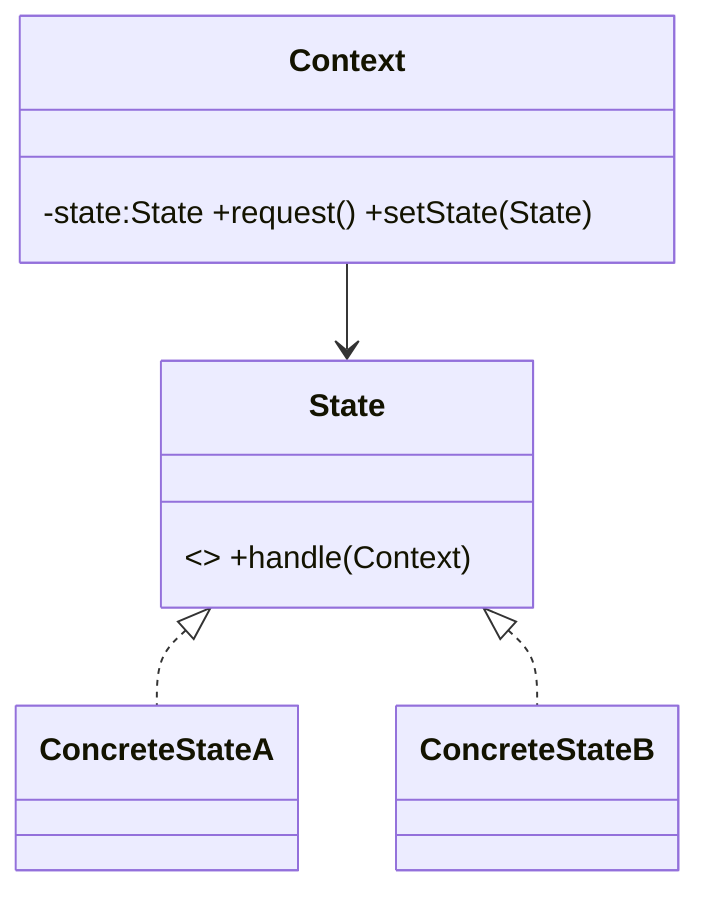
```mermaid
classDiagram
class Context{-state:State +request() +setState(State)}
class State{<<interface>> +handle(Context)}
class ConcreteStateA
class ConcreteStateB
State <|.. ConcreteStateA
State <|.. ConcreteStateB
Context --> State
```

**Participants**  
- *Context*: keeps current State.  
- *State/ConcreteState*: handle behavior and transitions.

**Collaborations**  
Context delegates to State; State may set next State.

**Consequences**  
+ Removes conditionals; localizes behavior.  
− More classes; transitions can be scattered.

**Implementation**  
- Immutable state singletons; tables for transitions.  
- Share states across contexts.

**Related Patterns**  
Strategy (different intent), Flyweight (share states).

---

### 21) Strategy
**Intent**  
Define a family of algorithms, encapsulate each, and make them interchangeable.

**Motivation**  
Sort with different comparators without changing the client.

**Applicability**  
- Multiple alternative algorithms.  
- Vary behavior at runtime.

**Structure**
```mermaid
classDiagram
class Context{-strategy:Strategy +setStrategy(Strategy) +doWork()}
class Strategy{<<interface>> +execute()}
class ConcreteStrategyA
class ConcreteStrategyB
Strategy <|.. ConcreteStrategyA
Strategy <|.. ConcreteStrategyB
Context --> Strategy
```

**Participants**  
- *Strategy/ConcreteStrategy*.  
- *Context* uses Strategy.

**Collaborations**  
Context delegates algorithm steps to Strategy.

**Consequences**  
+ Eliminates conditionals; promotes composition.  
− Overhead of strategy objects; clients must choose.

**Implementation**  
- Configure via DI; support null‑object strategy.  
- Parameterize strategies.

**Related Patterns**  
State (switches by state), Template Method (inheritance alternative).

---

### 22) Template Method
**Intent**  
Define the skeleton of an algorithm; subclasses fill steps.

**Motivation**  
Parsing pipeline with fixed stages and customizable hooks.

**Applicability**  
- Invariant sequence with variable steps.  
- Frameworks exposing hooks.

**Structure**
```mermaid
classDiagram
class AbstractClass{+templateMethod() #step1() #step2()}
class ConcreteClassA
class ConcreteClassB
AbstractClass <|-- ConcreteClassA
AbstractClass <|-- ConcreteClassB
```

**Participants**  
- *AbstractClass*: defines template & primitive operations.  
- *ConcreteClass*: implements steps.

**Collaborations**  
Client calls templateMethod(); base orchestrates calls to steps.

**Consequences**  
+ Code reuse and control; consistent workflow.  
− Inheritance coupling; hard to vary sequence.

**Implementation**  
- Hook methods; final template to prevent override.  
- Combine with Factory Method for object creation.

**Related Patterns**  
Strategy, Factory Method.

---

### 23) Visitor
**Intent**  
Represent an operation to be performed on elements of an object structure without changing the classes of the elements.

**Motivation**  
Compute multiple unrelated operations (pretty‑print, type‑check) over ASTs without polluting node classes.

**Applicability**  
- Stable element hierarchy; frequently changing operations.  
- Need double dispatch.

**Structure**
```mermaid
classDiagram
class Visitor{<<interface>> +visitElementA(ElementA) +visitElementB(ElementB)}
class ConcreteVisitor
class Element{<<interface>> +accept(Visitor)}
class ElementA
class ElementB
class ObjectStructure
Visitor <|.. ConcreteVisitor
Element <|-- ElementA
Element <|-- ElementB
ObjectStructure o--> Element
Element --> Visitor
```

**Participants**  
- *Visitor/ConcreteVisitor*.  
- *Element/ConcreteElement*: accept a visitor.  
- *ObjectStructure*: holds elements.

**Collaborations**  
Element calls back `visitor.visit(this)` enabling double dispatch.

**Consequences**  
+ Add new operations easily; separates concerns.  
− Hard to add new element types; traversals can be verbose.

**Implementation**  
- Acyclic vs. classic Visitor; default/empty methods.  
- Reflective visitors where supported.

**Related Patterns**  
Composite, Interpreter, Iterator.

---

## Notes
- *Collaborations* are kept concise; expand with sequence diagrams if needed.  
- Add *Known Uses*/*Sample Code* sections per language or framework when you tailor this to a specific course or repo.

