# 🎮 Adapter Pattern – Pygame Example

This project demonstrates the **Adapter Design Pattern** in Python using **Pygame**.  
It implements a simple game where a **Character (Adaptee)** can be controlled either by **keyboard** or **mouse**, thanks to **adapters** that translate inputs into a unified set of **commands**.

---

## 🎯 What is the Adapter Pattern?

The **Adapter Pattern** is a **structural design pattern** that allows objects with incompatible interfaces to collaborate.  
It acts as a **bridge** between a client expecting one interface and a class that provides another.

### ✅ Key Idea
- **Adaptee** → A class with an existing interface (e.g., `Character` expects `Command` objects).  
- **Target Interface** → The interface expected by the client (e.g., `InputAdapter.poll()` returns a `Command`).  
- **Adapter** → Converts data or calls from one interface to another (e.g., converts keyboard/mouse events to `Command` objects).  

This lets the **Character** be controlled by different input systems **without changing its code**.

---

## 🧩 How It Works in This Project

### 🎮 Adaptee: `Character`
The **Character** class represents the game object (player).  
It does not directly interact with Pygame events — it only accepts a `Command` object describing:
- `move` (left / right / idle)
- `jump_pressed` (bool)
- `dash_pressed` (bool)

This makes the character logic **independent** from specific input systems.

```python
@dataclass
class Command:
    move: int
    jump_pressed: bool
    dash_pressed: bool
```

The character only knows how to **interpret commands**:
```python
player.apply(cmd, dt)
```

---

### 🎯 Target Interface: `InputAdapter`
Defines the expected behavior for any input adapter.

```python
class InputAdapter(ABC):
    @abstractmethod
    def poll(self, character_rect: pygame.Rect) -> Command:
        pass
```

---

### 🔌 Concrete Adapters
These adapters **translate** input events into `Command` objects.

#### `KeyboardAdapter`
- Converts **arrow keys / WASD / space / shift** into commands.

```python
if keys[pygame.K_LEFT] or keys[pygame.K_a]:
    move -= 1
if keys[pygame.K_RIGHT] or keys[pygame.K_d]:
    move += 1
jump_pressed = keys[pygame.K_SPACE]
```

#### `MouseAdapter`
- Uses **mouse position and clicks** for control:
  - Hold **LMB** → move toward cursor.
  - Click **RMB** → jump.
  - Click **LMB** → dash.

```python
mx, my = pygame.mouse.get_pos()
lmb, _, rmb = pygame.mouse.get_pressed(num_buttons=3)
```

---

### 🔁 Switching Adapters at Runtime
Press **TAB** to switch between the two adapters while the game is running.  
The main loop uses a **common interface**, so the change is seamless.

```python
adapter = adapters[active_idx]
cmd = adapter.poll(player.rect())
player.apply(cmd, dt)
```

---

## 🧭 UML Diagram (Mermaid)
### Class Diagram


### Sequence Diagram

```mermaid
sequenceDiagram
    autonumber
    participant GameLoop as 🎮 Game Loop (main)
    participant Adapter as 🔌 InputAdapter (Keyboard / Mouse)
    participant Command as 🧩 Command Object
    participant Character as 🧍 Character (Adaptee)

    GameLoop->>Adapter: poll(character_rect)
    note right of Adapter: Reads keyboard or mouse input<br/>and translates to a Command
    Adapter-->>Command: create Command(move, jump, dash)
    Adapter-->>GameLoop: return Command
    
    GameLoop->>Character: apply(Command, dt)
    note right of Character: Interprets Command<br/>and updates position, velocity, jump, dash
    
    Character->>Character: update physics (gravity, collision)
    Character-->>GameLoop: new state (x, y, vx, vy)
    
    GameLoop->>Character: draw(surface)
    Character-->>GameLoop: rendered character
```


---

## 🕹 Controls

| Action | Keyboard Adapter | Mouse Adapter |
|--------|------------------|----------------|
| Move   | ← / → or A / D   | Hold LMB toward cursor |
| Jump   | Space / W / ↑     | Right-click |
| Dash   | Shift / Ctrl      | Left-click |
| Switch Adapter | TAB | TAB |
| Quit | ESC | ESC |

---

## 🚀 Run the Demo

### Requirements
```bash
pip install pygame
```

### Run
```bash
python adapter_pygame_demo.py
```

---

## 💡 Key Benefits

| Principle | Explanation |
|------------|-------------|
| **Decoupling** | Character logic doesn’t depend on input device details. |
| **Reusability** | The same adapters could be used for other characters. |
| **Extensibility** | Easily add a `GamepadAdapter` without touching `Character`. |
| **Polymorphism** | The main loop uses all adapters through a single interface. |

---

## 🧠 Possible Extensions

- Add a **GamepadAdapter** for controller input.  
- Add a **NetworkAdapter** to control the character remotely.  
- Integrate **AI-based control** by sending generated `Command`s.  

---

## 📖 References
- *Gamma, Helm, Johnson, Vlissides (GoF)* – *Design Patterns: Elements of Reusable Object-Oriented Software*  
- [Refactoring.Guru – Adapter Pattern](https://refactoring.guru/design-patterns/adapter)  
- [Pygame Documentation](https://www.pygame.org/docs/)

---

Enjoy experimenting with **design patterns in games**! 🧩🎮
