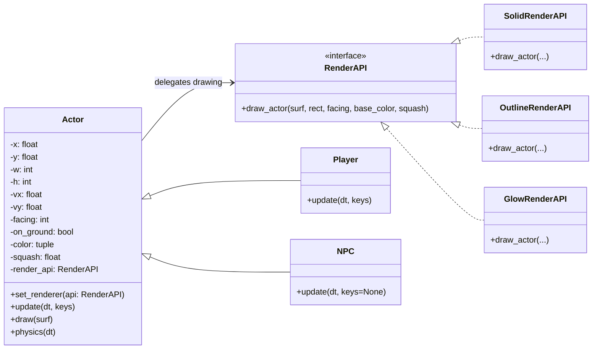

# 🧱 Bridge Pattern – Pygame Demo

This project demonstrates the **Bridge Design Pattern** in Python using **Pygame**.  
You control a `Player` and watch an `NPC` patrol while **swapping rendering styles at runtime**. The **abstraction hierarchy** (`Actor` → `Player`, `NPC`) is decoupled from the **implementor hierarchy** (`RenderAPI` → `SolidRenderAPI`, `OutlineRenderAPI`, `GlowRenderAPI`).

---

## 🎯 What is the Bridge Pattern?

The **Bridge** is a **structural design pattern** that **decouples an abstraction from its implementation** so the two can vary **independently**.  
Instead of binding a class to one implementation at compile time, the abstraction **holds a reference** to an implementor interface, which can be **swapped** without changing the abstraction.

**Why use it here?**
- We want different **rendering strategies** (solid/outline/glow) for the same game entities.
- We also want to add **new entities** (Player/NPC/Enemies) without touching rendering code.
- With Bridge, you can extend **both sides** independently.

---

## 🧩 Mapping from the code

- **Abstraction**: `Actor` — common game entity with physics and `draw(...)` that **delegates** to a `RenderAPI`.
- **Refined Abstractions**:  
  - `Player` — keyboard-controlled actor.  
  - `NPC` — simple patrol AI.
- **Implementor**: `RenderAPI` — interface with `draw_actor(...)`.
- **Concrete Implementors**:  
  - `SolidRenderAPI` — fills the rectangle (basic look).  
  - `OutlineRenderAPI` — adds a white outline.  
  - `GlowRenderAPI` — draws translucent halos for a glow effect.
- **Bridge in action**: Press **1/2/3** to change the `Player` renderer, and **7/8/9** to change the `NPC` renderer — at runtime.

---

## 🕹 Controls

- **Move Player**: `A/D` or `←/→`  
- **Jump**: `SPACE` (or `W`, `↑`)  
- **Switch Player renderer**: `1` Solid, `2` Outline, `3` Glow  
- **Switch NPC renderer**: `7` Solid, `8` Outline, `9` Glow  
- **Quit**: `ESC`

---

## 🧭 Class Diagram (Mermaid)



---

## 🔄 Sequence Diagram (Mermaid)

```mermaid
sequenceDiagram
  autonumber
  participant GameLoop as 🎮 Game Loop
  participant Player as 🧍 Player (Abstraction)
  participant NPC as 🤖 NPC (Abstraction)
  participant PlayerAPI as 🎨 Player RenderAPI (Implementor)
  participant NPCAPI as 🎨 NPC RenderAPI (Implementor)

  GameLoop->>Player: update(dt, keys)
  Player->>Player: physics(dt)

  GameLoop->>NPC: update(dt)
  NPC->>NPC: physics(dt)

  GameLoop->>Player: draw(surface)
  Player->>PlayerAPI: draw_actor(surface, rect, facing, color, squash)
  PlayerAPI-->>GameLoop: rendered player

  GameLoop->>NPC: draw(surface)
  NPC->>NPCAPI: draw_actor(surface, rect, facing, color, squash)
  NPCAPI-->>GameLoop: rendered npc

  Note over GameLoop,PlayerAPI: Press 1/2/3 to swap Player's RenderAPI at runtime
  Note over GameLoop,NPCAPI: Press 7/8/9 to swap NPC's RenderAPI at runtime
```



---

## 🧪 How to Run

1) Install dependencies:
```bash
pip install pygame
```

2) Save the demo code as `bridge_pygame_demo.py` and run:
```bash
python bridge_pygame_demo.py
```

---

## 💡 Why this is Bridge (and not Strategy)

- **Bridge**: The `Actor` is the **abstraction**; `RenderAPI` is the **implementor**. Both have **their own class hierarchies** and vary independently. The key is **composition via an interface** that you can swap at runtime, but the pattern stresses **separating two dimensions** (entities vs. rendering).
- **Strategy**: Looks similar, but Strategy usually focuses on **one axis of variation** (an algorithm family) without the “two hierarchies that evolve independently” emphasis.

---

## 🚀 Extensions

- Add a `ShadowRenderAPI` that renders a drop shadow.
- Add new refined abstractions (e.g., `FlyingEnemy`, `Boss`) that reuse any `RenderAPI`.
- Let each actor have its own **animation state** while sharing renderers.
- Persist renderer selections and expose a debug menu.

