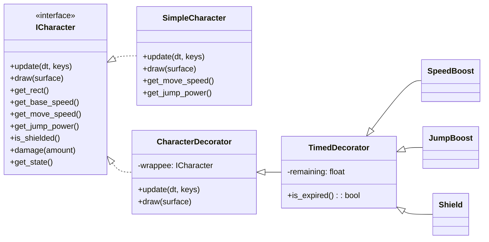

# Decorator Pattern – Pygame Runner

This project demonstrates the **Decorator Design Pattern** in Python using **Pygame**. The uploaded source file `decorator_app.py` contains a small runner-style demo where the player collects temporary power-ups implemented as decorators applied to a base character. 【64†source】

---

## 🎯 What is the Decorator Pattern?

The **Decorator Pattern** lets you **add behavior to individual objects dynamically** by wrapping them with one or more decorator objects that share the **same interface** as the wrapped object. This enables composition of features at runtime without modifying the original class (adhering to the **Open/Closed Principle**).

**Key ideas**
- A **Component interface** that both the **Concrete Component** and all **Decorators** implement.  
- A **Decorator base** that **forwards** calls to the wrapped component and can add behavior before/after delegation.  
- **Concrete Decorators** that modify or extend behavior (and can be stacked).

---

## 🧩 Mapping from the code (`decorator_app.py`)

- **Component Interface – `ICharacter`**: defines `update`, `draw`, `get_rect`, `get_base_speed`, `get_move_speed`, `get_jump_power`, `is_shielded`, `damage`, `get_state`. Decorators and the base character implement this API. 【64†source】  
- **Concrete Component – `SimpleCharacter`**: the base controllable avatar. Exposes stable base attributes like `_base_speed` and `_jump_power`, and handles physics (movement, jump, gravity, ground collision) and simple drawing. 【64†source】  
- **Decorator Base – `CharacterDecorator`**: holds a `wrappee: ICharacter` and **forwards** all interface methods to it, enabling stacking. 【64†source】  
- **Timed Decorator – `TimedDecorator`**: augments a decorator with a `remaining` timer, decreasing per frame; the helper `strip_expired_decorators` unwraps expired layers. 【64†source】  
- **Concrete Decorators**:  
  - `SpeedBoost`: scales `get_move_speed()` and draws a yellow aura. 【64†source】  
  - `JumpBoost`: increases `get_jump_power()` and draws a purple outline. 【64†source】  
  - `Shield`: overrides `is_shielded()` to prevent damage and renders a shield ellipse. 【64†source】  
- **World elements**: `Pickup(kind)` spawns speed/jump/shield items; `Hazard` damages the character on contact. The main loop applies decorators on pickup, removes hazards on collision, and strips expired decorators every frame. 【64†source】

---

## 🕹 How to run

### Requirements
- Python 3.10+
- `pygame`

```bash
pip install pygame
python decorator_app.py
```

**Controls**
- Move: `←/→` or `A/D`  
- Jump: `SPACE` or `W` or `↑`  
- Effects are temporary and can **stack**. Hazards reduce HP unless shielded. Game shows *Game Over* at 0 HP. 【64†source】

---

## ✅ Why Decorator fits this problem

- **Runtime composition**: Power-ups are applied only when collected, and they **stack** without changing the base class.  
- **Single responsibility**: Each decorator modifies a **single capability** (speed, jump, defense).  
- **Open/Closed**: Add a new ability by creating a new decorator class—no changes to `SimpleCharacter`.  
- **Graceful expiry**: `TimedDecorator` + `strip_expired_decorators` unwrap layers once they time out, returning the character to prior behavior. 【64†source】

---

## 🧠 Extension ideas

- Add a **DoubleJump** decorator overriding `get_jump_power()` and jump logic.  
- Add a **Magnet** decorator that attracts pickups within a radius.  
- Show a **stack viewer** UI listing active decorators with exact remaining time.  
- Persist high scores or add levels with different pickup/hazard frequencies.

---

## 📖 References

- Gamma, Helm, Johnson, Vlissides – *Design Patterns* (1994)  
- Refactoring.Guru – Decorator  
- Pygame documentation

---

## UML (Mermaid)

> Class Diagram


