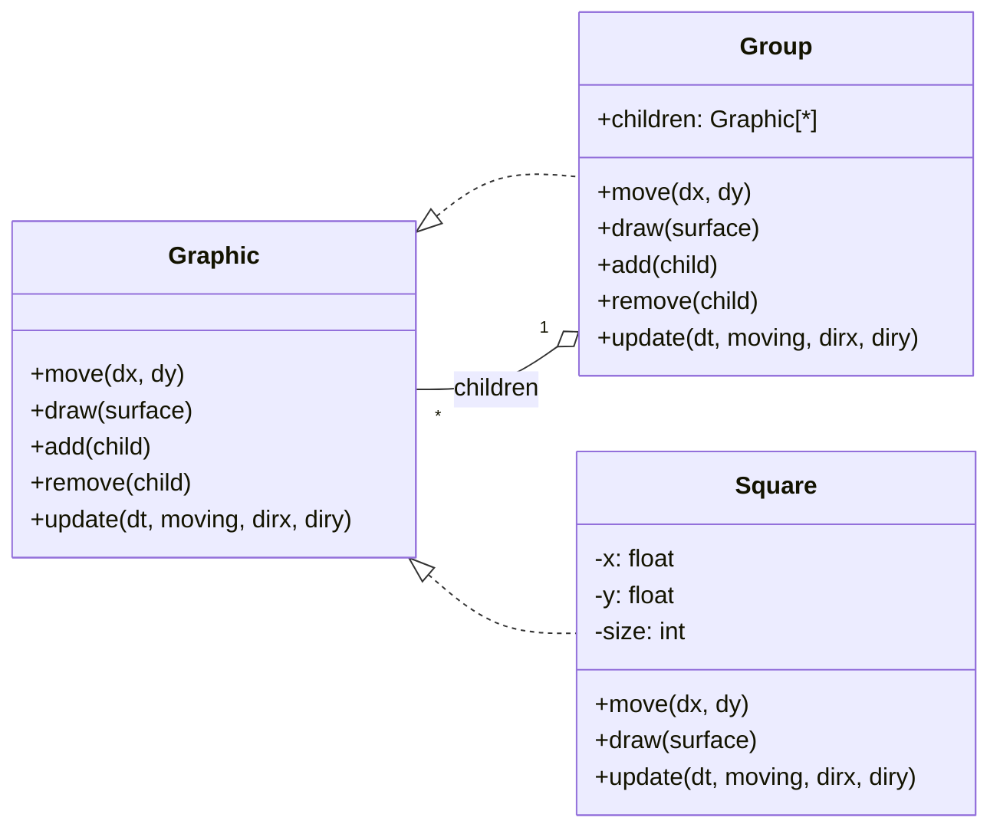
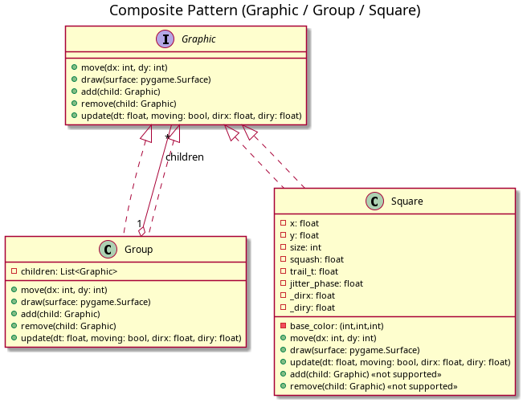

# Composite Pattern with Pygame – Animated Squares Demo

This project is a practical demonstration of the **Composite Design Pattern** in [Python](https://www.python.org/), using [pygame](https://www.pygame.org) for visualization.

It shows how a **population of squares** (organized in groups) can be treated uniformly as single objects:  
- Pressing the **arrow keys** moves all squares at once.  
- Pressing **+** adds new squares.  
- Pressing **-** removes squares.  
- Squares **wrap around** the screen using modular arithmetic.  
- Movement is animated with a squash-and-stretch effect and trailing ghosts.

---

## 🎯 What is the Composite Pattern?

The **Composite Pattern** lets you treat individual objects (**leaves**) and groups (**composites**) uniformly via a common interface.

### Roles
- **Component (`Graphic`)** – interface with `move`, `draw`, `add`, `remove`, `update`.
- **Leaf (`Square`)** – a drawable/movable unit (can’t `add`/`remove`).
- **Composite (`Group`)** – holds children (other `Group`s or `Square`s) and forwards calls.

### Why it helps
- One API for both **single** and **hierarchical** structures.
- Client code stays simple: call `root.move(...)` and the whole structure reacts.

---

## 🕹 Controls

- **Arrow Keys** → Move all squares (animated).  
- **+** → Add a random square to a random subgroup.  
- **-** → Remove one square (if any).  
- **ESC** → Quit.

Squares **wrap around** screen edges (modular arithmetic on X and Y).

---

## 📂 Project Structure

```
composite_app.py   # main demo script (composite + animation + wrapping + +/-)
README.md                  # this file
composite_uml.puml        # PlantUML diagram (safe for rendering)
```

---

## 🚀 How to Run

```bash
pip install pygame
python composite_app.py
```

---

## 🧭 UML Class Diagram

We provide both a **Mermaid diagram** (renders directly on GitHub) and a **PlantUML file** for offline rendering.

### Mermaid (recommended for GitHub)


### PlantUML (offline rendering)
See `composite_uml.puml` in this repo. Render with:
```bash
plantuml -tpng composite_uml.puml
```

Then reference the image in this README:
```markdown

```

---

## 📖 References

- [Composite Pattern (GoF)](https://refactoring.guru/es/design-patterns/composite)  
- [Pygame Documentation](https://www.pygame.org/docs/)

Enjoy exploring **design patterns** with an interactive visual! 🎮✨
