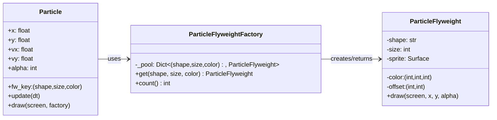

# 🌌 Flyweight Pattern – Pygame Particle Swarm

This project demonstrates the **Flyweight Design Pattern** in Python using **Pygame**.  
It renders **thousands of particles** efficiently by sharing **intrinsic state** (shape, size, color, and a pre-rendered sprite) between many particles; each particle only stores its **extrinsic state** (position, velocity, alpha).

---

## 🎯 What is the Flyweight Pattern?

The **Flyweight** is a **structural pattern** that minimizes memory usage by **sharing state** across many similar objects.

- **Intrinsic state (shared):** data that is identical for many instances (e.g., shape, size, color, pre-rendered image).
- **Extrinsic state (per-instance):** data that varies per object and can’t be shared (e.g., position, velocity, transparency).

Instead of making a full copy for every particle, we keep a **small cache of flyweights** and let particles **reference** them.

---

## 🧩 Mapping in This Project

| Pattern Role | Class | Responsibility |
|---------------|--------|----------------|
| **Flyweight** | `ParticleFlyweight` | Stores intrinsic state (shape, size, color, pre-rendered sprite). |
| **Factory** | `ParticleFlyweightFactory` | Caches and returns shared flyweight objects. |
| **Context / Client** | `Particle` | Holds extrinsic state (position, velocity, alpha) and references a flyweight. |
| **Demo Environment** | `main()` | Manages creation, update, and rendering of thousands of particles. |

---

## 🧭 Class Diagram (Mermaid)



---

## 🧪 How to Run

```bash
pip install pygame
python flyweight_pygame_demo.py
```

### Controls

| Key | Action |
|-----|---------|
| `SPACE` | Add 1,000 random particles |
| `1 / 2 / 3` | Add 250 particles of preset styles |
| `C` | Clear all particles |
| `ESC` | Quit |

The HUD displays: **Particles count**, **Flyweights cached**, and **FPS**.

---

## 🔍 Code Highlights

### 1) Flyweight (intrinsic state)

```python
class ParticleFlyweight:
    def __init__(self, shape: str, size: int, color: Tuple[int,int,int]):
        self.shape, self.size, self.color = shape, size, color
        s = size * 2
        surf = pygame.Surface((s, s), pygame.SRCALPHA)
        if shape == "circle":
            pygame.draw.circle(surf, color, (s//2, s//2), size)
        else:
            pygame.draw.rect(surf, color, (0, 0, s, s), border_radius=max(4, size//3))
        self.sprite = surf
        self.offset = (s//2, s//2)

    def draw(self, screen, x, y, alpha=255):
        if alpha >= 255:
            screen.blit(self.sprite, (int(x - self.offset[0]), int(y - self.offset[1])))
        else:
            temp = self.sprite.copy()
            temp.fill((255,255,255,alpha), special_flags=pygame.BLEND_RGBA_MULT)
            screen.blit(temp, (int(x - self.offset[0]), int(y - self.offset[1])))
```

### 2) Flyweight Factory (cache)

```python
class ParticleFlyweightFactory:
    def __init__(self):
        self._pool = {}

    def get(self, shape, size, color):
        key = (shape, size, color)
        if key not in self._pool:
            self._pool[key] = ParticleFlyweight(shape, size, color)
        return self._pool[key]

    def count(self) -> int:
        return len(self._pool)
```

### 3) Particle (extrinsic state only)

```python
@dataclass
class Particle:
    x: float; y: float; vx: float; vy: float; alpha: int
    fw_key: Tuple[str, int, Tuple[int,int,int]]

    def update(self, dt):
        self.x = (self.x + self.vx * dt) % WIDTH
        self.y = (self.y + self.vy * dt) % HEIGHT
        self.alpha = max(90, min(255, self.alpha + random.randint(-10, 10)))

    def draw(self, screen, factory):
        shape, size, color = self.fw_key
        fw = factory.get(shape, size, color)
        fw.draw(screen, self.x, self.y, self.alpha)
```

---

## ✅ Why This is Flyweight (and not Prototype/Pool)

| Pattern | Focus | Behavior |
|----------|--------|-----------|
| **Flyweight** | Shared intrinsic state | Reuses immutable data (sprite) across many instances |
| **Prototype** | Cloning | Copies whole objects (no sharing) |
| **Object Pool** | Reuse of live objects | Manages active/inactive instances |

In this demo, thousands of particles share only a handful of **Flyweights**, proving that memory and rendering are highly optimized.

---

## 🚀 Extensions & Ideas

- Add **rotated flyweights** (e.g., 16 angles per shape) for rotated sprites.  
- Introduce **texture atlas caching** for even faster blitting.  
- Use **culling** or spatial partitioning to manage 50k+ particles smoothly.  
- Combine with the **Prototype** pattern to spawn preset particle types.

---

💡 With **Flyweight**, even massive particle systems can remain efficient — perfect for effects, swarms, or procedural animations! 🌟
