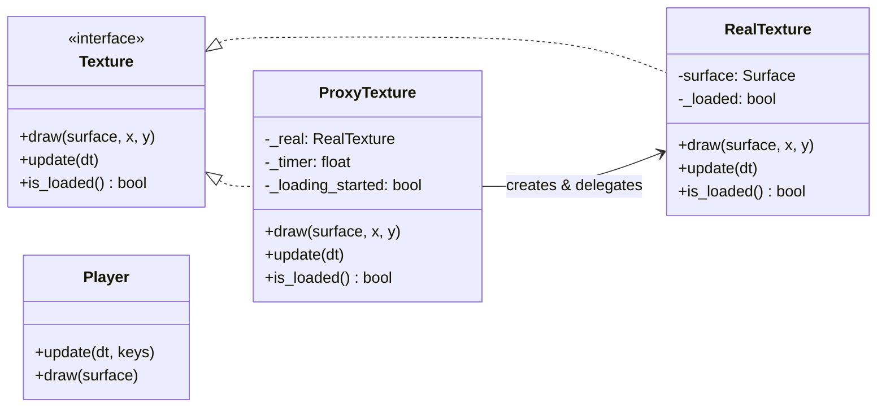

# 🧱 Proxy Pattern – Pygame Demo

This project demonstrates the **Proxy Design Pattern** in Python using **Pygame**.  
It implements a **Virtual Proxy** that stands in for a heavy graphical resource — a large background texture.  
The proxy displays a **lightweight placeholder** and later **loads the heavy asset asynchronously** (simulated with a timer).

---

## 🎯 What is the Proxy Pattern?

The **Proxy** is a **structural design pattern** that provides a **substitute or placeholder** for another object to **control access** to it.  
It acts as an intermediary that can perform operations like **lazy loading**, **access control**, **logging**, or **caching** before delegating to the real object.

**Common Proxy types:**
- **Virtual Proxy** → delays creation of heavy resources.
- **Protection Proxy** → restricts access based on permissions.
- **Remote Proxy** → controls access to remote objects (e.g., via network).
- **Smart Reference Proxy** → adds behavior like reference counting.

In this example, we use a **Virtual Proxy** to simulate **lazy loading** of a heavy texture.

---

## 🧩 Mapping in This Project

| Pattern Role | Class | Responsibility |
|---------------|--------|----------------|
| **Subject** | `Texture` | Common interface for drawing and updating textures. |
| **RealSubject** | `RealTexture` | Simulates a heavy texture load and handles actual rendering. |
| **Proxy** | `ProxyTexture` | Draws a lightweight placeholder and loads `RealTexture` later. |
| **Client** | Game loop | Uses `Texture` interface, unaware of whether it’s a proxy or real object. |

---

## 🧭 Class Diagram (Mermaid)



---


## 🕹 Controls

| Key | Action |
|-----|---------|
| **A / D** | Move player left/right |
| **SPACE** | Jump |
| **P** | Toggle Proxy (Virtual Proxy ON/OFF) |
| **V** | Toggle Background visibility |
| **ESC** | Quit game |

---

## 🧠 Code Explanation

### 🎨 Texture Interface

Defines the methods both real and proxy textures must implement.

```python
class Texture(ABC):
    @abstractmethod
    def draw(self, surface, x, y): ...
    @abstractmethod
    def update(self, dt): ...
    @abstractmethod
    def is_loaded(self) -> bool: ...
```

### 🖼️ RealTexture (RealSubject)

Simulates loading a large texture with `time.sleep()` to show the blocking delay.

```python
class RealTexture(Texture):
    def __init__(self, w, h, blocking=True):
        if blocking:
            time.sleep(1.0)  # simulate heavy load
        self.surface = self._generate_surface(w, h)
        self._loaded = True

    def draw(self, surface, x, y):
        surface.blit(self.surface, (x, y))
```

### 🧩 ProxyTexture (Virtual Proxy)

Shows a loading spinner immediately, while internally creating the real texture after a delay.

```python
class ProxyTexture(Texture):
    LOAD_DELAY = 1.2

    def __init__(self, w, h):
        self._real = None
        self._timer = 0.0
        self._loading_started = False

    def update(self, dt):
        self._timer += dt
        if self._timer >= self.LOAD_DELAY and not self._loading_started:
            self._real = RealTexture(self.w, self.h, blocking=False)
            self._loading_started = True

    def draw(self, surface, x, y):
        if self._real and self._real.is_loaded():
            self._real.draw(surface, x, y)
        else:
            # draw placeholder with spinner
            ...
```

### 🎮 Game Loop (Client)

- Creates both a `RealTexture` and a `ProxyTexture`.
- Toggles between them at runtime using key **P**.

---

## ✅ Why This Is Proxy (and Not Bridge or Decorator)

| Pattern | Purpose | Example in this demo |
|----------|----------|----------------------|
| **Proxy** | Controls access, defers creation | ProxyTexture delays RealTexture loading |
| **Bridge** | Decouples abstraction and implementation | Not used here — both Real/Proxy share interface |
| **Decorator** | Adds new behavior dynamically | Would add new visual effects around draw() |

---

## 🚀 Run the Demo

```bash
pip install pygame
python proxy_pygame_demo.py
```

Try toggling Proxy mode (**P**) to feel the difference between blocking and non-blocking texture loading.

---

✨ **Key Insight:**  
The **Virtual Proxy** enables **smooth, non-blocking gameplay** while the heavy resource loads lazily in the background — demonstrating how Proxy patterns improve performance and UX in real-time systems.
