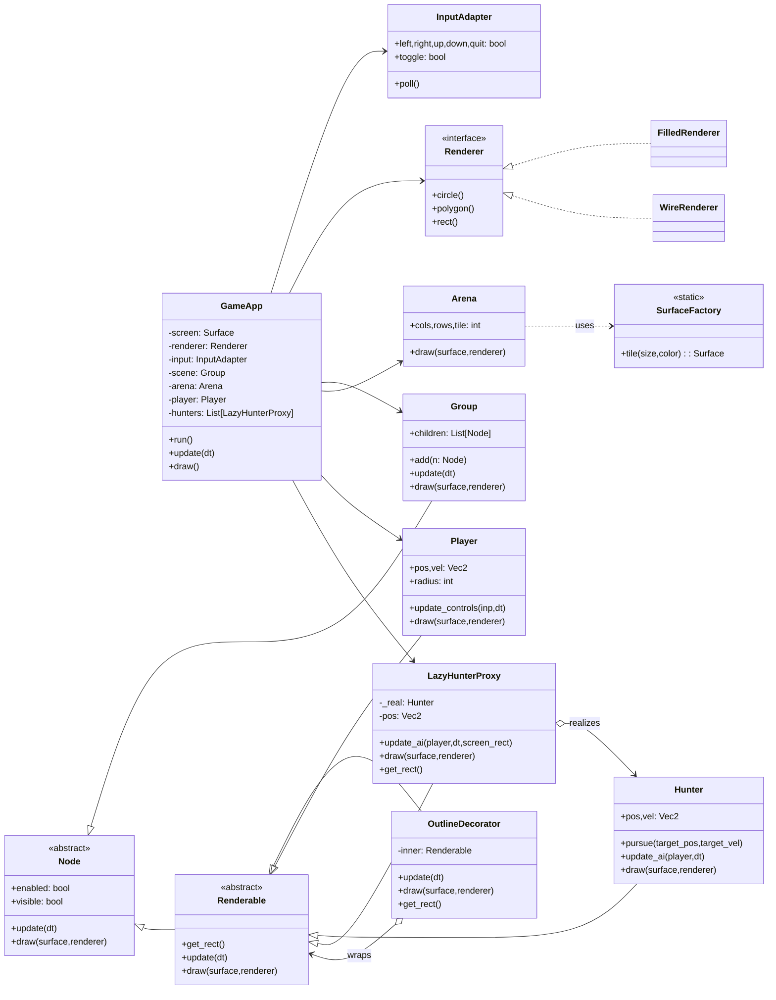

# Pursuit Chase — Structural Patterns in Pygame

A small pursuit-style chase game that demonstrates several **GoF structural design patterns** using **pygame**. You control the player while multiple hunters use a pursuit steering behavior to chase you.

---

## 🔧 Implemented Structural Patterns

| Pattern | Class | Description |
|----------|--------|-------------|
| **Facade** | `GameApp` | Encapsulates pygame initialization, main loop, scene composition, and HUD drawing. |
| **Adapter** | `InputAdapter` | Provides a uniform interface for keyboard input, with attributes like `left`, `right`, `up`, `down`, and `toggle`. |
| **Composite** | `Node`, `Group` | Establishes a scene graph where `Group` manages and updates all child nodes uniformly. |
| **Bridge** | `Renderer`, `FilledRenderer`, `WireRenderer` | Decouples drawing logic from shapes and entities. The user can toggle between filled and wireframe rendering using **TAB**. |
| **Decorator** | `OutlineDecorator` | Wraps any `Renderable` object (like `Player`) to add an outline without changing its internal logic. |
| **Flyweight** | `SurfaceFactory` | Reuses and caches small tile `Surface`s to efficiently render the arena background. |
| **Proxy** | `LazyHunterProxy` | Represents a lightweight placeholder for `Hunter`. Hunters are realized only when they approach the player or appear on screen, saving resources. |

---

## 🎮 Gameplay

**Controls:**
- Move: **WASD** or **Arrow keys**
- Toggle renderer (Bridge): **TAB**
- Quit: **ESC**

**Goal:**
Avoid being caught by the hunters for as long as possible. Your score is based on survival time.

Hunters begin as proxy placeholders that **drift** toward the player. Once close or visible, they **realize** into full `Hunter` objects and actively pursue the player using predictive steering.

A **radar** in the top-left corner displays all hunters, both realized and proxy.

---

## 📝 Class Diagram (Mermaid)



---

## 🔍 Technical Notes

- **Pursuit Steering:** Hunters predict where the player will be using velocity and a short lookahead time.
- **Proxy Behavior:** `LazyHunterProxy` placeholders drift toward the player even before realization, ensuring visual presence.
- **Performance:** Only visible or nearby hunters are fully simulated. Others remain as light proxy markers.
- **Bridge Toggle:** The rendering style can be changed dynamically with **TAB**.

---

## 📂 Project Files

```
structural_app.py   # Main pygame implementation
README.md          # Documentation and diagram
```

---

## 📊 Future Extensions

- Add obstacle avoidance using **Decorator** for AI behaviors.
- Extend `Renderer` with shaders or textures.
- Implement `Composite` grouping for multiple pursuit teams.
- Introduce `Facade`-style menu and state transitions for a complete game loop.

